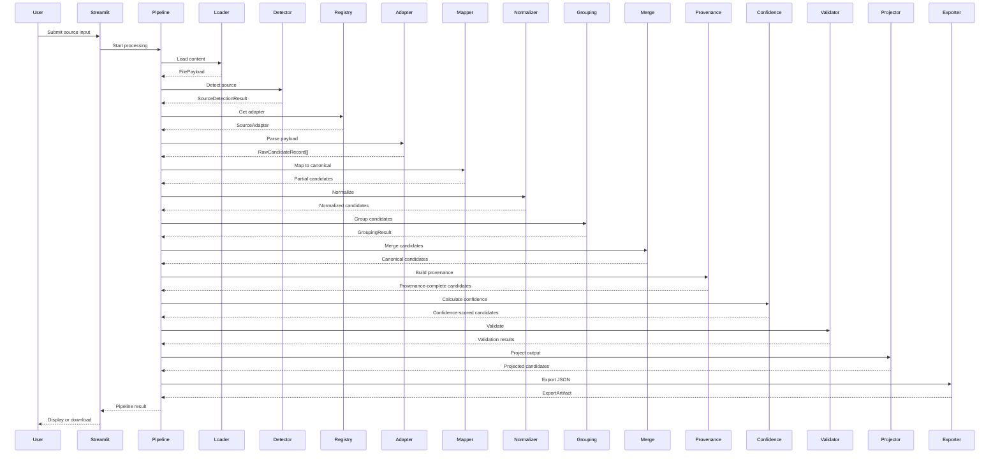
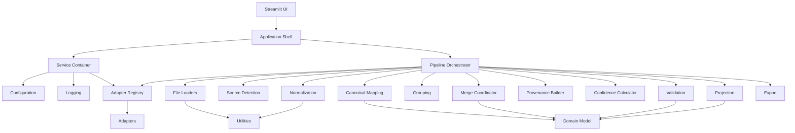
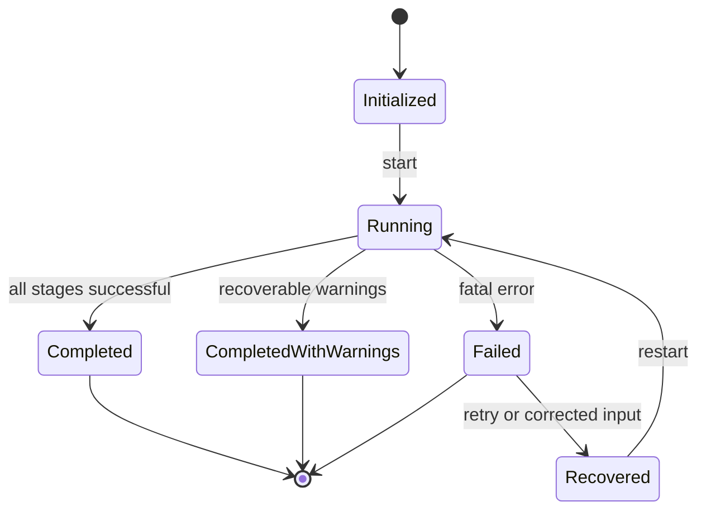
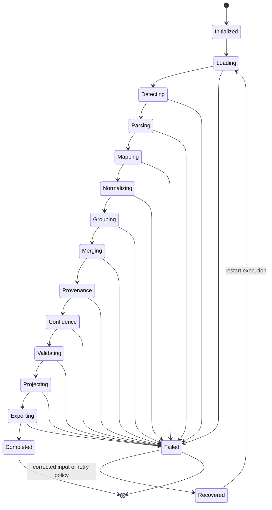
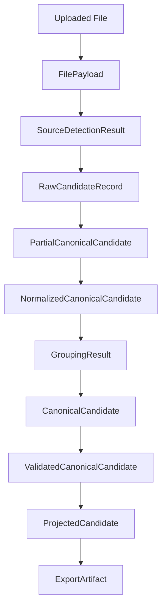

# Pipeline Architecture Specification

## 1. Purpose

### Why The Pipeline Exists

The Candidate Intelligence Transformation Engine pipeline exists to transform heterogeneous candidate inputs into a canonical, explainable, validated, and projection-ready candidate representation. It provides the processing architecture that coordinates file loading, source detection, adapter execution, canonical mapping, normalization, grouping, merge, confidence, provenance, validation, projection, and export.

The pipeline is the orchestration boundary. It does not own domain rules directly; it coordinates stage-specific components through explicit contracts.

### Architectural Goals

- Keep every stage single-purpose and independently testable.
- Preserve deterministic processing for identical inputs and configuration.
- Ensure every business value is explainable through provenance, confidence, and decisions.
- Keep raw source records immutable after ingestion.
- Prevent downstream modules from depending on external schemas.
- Support future source types without changing the core pipeline contract.
- Fail gracefully for recoverable source-level errors and fail fast for invalid configuration.
- Keep AI usage bounded to non-deterministic extraction tasks where deterministic approaches are insufficient.

### Scope

This specification defines:

- Processing flow.
- Stage responsibilities.
- Stage input and output contracts.
- Ownership and mutation policy.
- PipelineContext lifecycle.
- Loader, detector, adapter, mapping, normalization, grouping, merge, confidence, provenance, validation, projection, and export architecture.
- Error handling and recovery strategy.
- AI integration boundaries.
- Extension points and future evolution.

### Non-Goals

- This document does not define Python classes.
- This document does not define Pydantic models.
- This document does not implement business logic.
- This document does not define UI screen behavior beyond pipeline interaction.
- This document does not define storage, database, or deployment architecture.

## 2. High-Level Processing Flow

```text
User
  |
  v
Streamlit Shell
  |
  v
Pipeline Orchestrator
  |
  v
File Loader
  |
  v
Source Detection
  |
  v
Adapter Registry
  |
  v
Source Adapter
  |
  v
RawCandidateRecord
  |
  v
Canonical Mapping
  |
  v
Normalization
  |
  v
Candidate Grouping
  |
  v
Merge Coordinator
  |
  v
Provenance Builder
  |
  v
Confidence Calculator
  |
  v
Validation
  |
  v
Projection
  |
  v
JSON Export
  |
  v
Streamlit Output
```

### Stage Rationale

| Stage | Why It Exists |
| --- | --- |
| Streamlit Shell | Provides a minimal user-facing entry point and delegates processing to the pipeline. |
| Pipeline Orchestrator | Coordinates stage execution, lifecycle hooks, metrics, warnings, and errors. |
| File Loader | Converts uploaded content into safe, bounded, typed file payloads without business interpretation. |
| Source Detection | Classifies technical file type and likely business source so the correct adapter can be selected. |
| Adapter Registry | Provides explicit adapter lookup without hard-coded adapter construction. |
| Source Adapter | Converts source-specific payloads into raw candidate records. |
| RawCandidateRecord | Preserves immutable source evidence. |
| Canonical Mapping | Maps source values into canonical candidate structures. |
| Normalization | Standardizes comparable values such as email, phone, dates, skills, locations, and URLs. |
| Candidate Grouping | Groups records that may represent the same person. |
| Merge Coordinator | Resolves grouped candidate evidence into one canonical candidate. |
| Provenance Builder | Ensures every selected value can be traced back to source evidence. |
| Confidence Calculator | Assigns reliability scores to values and entities using provenance and agreement signals. |
| Validation | Verifies structural, semantic, business, and projection readiness rules. |
| Projection | Converts internal canonical representation into assignment output schema. |
| JSON Export | Serializes projected output deterministically. |
| Streamlit Output | Presents downloadable or viewable results without owning business logic. |

## 3. Stage Specifications

### 3.1 Streamlit Shell

| Attribute | Specification |
| --- | --- |
| Purpose | Provide the UI entry point and pass user intent into the application shell. |
| Responsibilities | Initialize the app shell, display status, collect future inputs, display outputs. |
| Inputs | User action, configuration status, pipeline result. |
| Outputs | Rendered status and future downloadable output. |
| Dependencies | ServiceContainer, CandidatePipeline, configuration, logging. |
| Allowed Side Effects | UI rendering and user-facing status display. |
| Failure Modes | Configuration unavailable, pipeline startup failure, rendering failure. |
| Recovery Strategy | Show safe error message and preserve logs. |
| Ownership | UI owns presentation only. |
| Mutation Policy | Must not mutate domain objects. |
| Logging Requirements | Log startup and user-triggered pipeline invocation metadata only. |
| Performance Expectations | UI should remain responsive; long-running work must be delegated. |

**Input Contract -> Output Contract**

`UserAction + ApplicationServices -> PipelineInvocationResult`

### 3.2 Pipeline Orchestrator

| Attribute | Specification |
| --- | --- |
| Purpose | Coordinate pipeline stages in deterministic order. |
| Responsibilities | Maintain PipelineContext, call lifecycle hooks, collect metrics, propagate errors. |
| Inputs | PipelineContext, ServiceContainer, configured stage sequence. |
| Outputs | StageResult or final projected export. |
| Dependencies | ServiceContainer, logger, configuration, adapter registry, stage components. |
| Allowed Side Effects | Structured logs and execution metrics. |
| Failure Modes | Stage contract violation, fatal configuration error, unexpected stage exception. |
| Recovery Strategy | Call `on_error`, record error in PipelineContext, stop or continue according to severity. |
| Ownership | Pipeline owns orchestration and PipelineContext mutation during execution. |
| Mutation Policy | May mutate PipelineContext warnings, errors, metadata, metrics, and audit fields. |
| Logging Requirements | Log pipeline version, app version, timestamp, sprint, active configuration summary, stage timings. |
| Performance Expectations | Stage orchestration overhead must be negligible relative to parsing and extraction. |

**Input Contract -> Output Contract**

`PipelineContext -> StageResult`

### 3.3 File Loader

| Attribute | Specification |
| --- | --- |
| Purpose | Safely read uploaded file bytes or API payloads into technical payload objects. |
| Responsibilities | Validate size, extension, MIME hints, and readable content boundaries. |
| Inputs | Uploaded file, filesystem path, API response, or stream. |
| Outputs | FilePayload containing bytes/text/metadata. |
| Dependencies | Configuration, file utilities, security limits. |
| Allowed Side Effects | Temporary file creation if configured. |
| Failure Modes | Unsupported file type, oversized input, unreadable stream, corrupted file. |
| Recovery Strategy | Mark file-level failure and continue other files when batch mode exists. |
| Ownership | Loader owns technical content extraction only. |
| Mutation Policy | Must not mutate uploaded source. |
| Logging Requirements | Log file type, size, checksum, and failure category; never log full candidate content. |
| Performance Expectations | Must stream or bound memory for large files where possible. |

**Input Contract -> Output Contract**

`UploadedContent -> FilePayload`

### 3.4 Source Detection

| Attribute | Specification |
| --- | --- |
| Purpose | Classify technical file type and likely business source. |
| Responsibilities | Determine file type, source family, confidence, and adapter key. |
| Inputs | FilePayload and source metadata. |
| Outputs | SourceDetectionResult. |
| Dependencies | Detection rules, configuration, adapter registry metadata. |
| Allowed Side Effects | None. |
| Failure Modes | Ambiguous source, unsupported source, conflicting signals. |
| Recovery Strategy | Emit warning for ambiguity; fail source only when no adapter can handle it. |
| Ownership | Detector owns classification, not parsing. |
| Mutation Policy | Must return a new detection result. |
| Logging Requirements | Log detection outcome, confidence, and rule identifiers. |
| Performance Expectations | Should be fast and deterministic; avoid full document parsing when possible. |

**Input Contract -> Output Contract**

`FilePayload -> SourceDetectionResult`

### 3.5 Adapter Registry Lookup

| Attribute | Specification |
| --- | --- |
| Purpose | Resolve a source type to a registered adapter. |
| Responsibilities | Register, unregister, list, and retrieve adapters. |
| Inputs | Adapter key or source type. |
| Outputs | Adapter instance or registry error. |
| Dependencies | None beyond registered adapters. |
| Allowed Side Effects | Registry mutation during application setup only. |
| Failure Modes | Adapter missing, duplicate registration. |
| Recovery Strategy | Fail source with adapter error; continue unrelated sources where possible. |
| Ownership | ServiceContainer owns registry lifetime. |
| Mutation Policy | Runtime pipeline lookup must not mutate registry. |
| Logging Requirements | Log missing adapter and duplicate registration as infrastructure errors. |
| Performance Expectations | Lookup must be constant or near-constant time. |

**Input Contract -> Output Contract**

`SourceType -> BaseAdapter`

### 3.6 Source Adapter

| Attribute | Specification |
| --- | --- |
| Purpose | Convert source-specific technical payload into raw candidate records. |
| Responsibilities | Load source payload, parse source structure, expose metadata, create raw records. |
| Inputs | FilePayload, SourceDetectionResult, adapter configuration. |
| Outputs | RawCandidateRecord collection. |
| Dependencies | Source-specific parser utilities only. |
| Allowed Side Effects | None except controlled temporary extraction if required by document parsing. |
| Failure Modes | Parse failure, invalid source structure, unsupported schema version. |
| Recovery Strategy | Emit adapter error with source-level context; continue other sources where possible. |
| Ownership | Adapter owns source-specific interpretation only. |
| Mutation Policy | Must not mutate FilePayload; must create new raw records. |
| Logging Requirements | Log adapter type, schema version, record count, and failure category. |
| Performance Expectations | Must handle expected source sizes within configured limits. |

**Input Contract -> Output Contract**

`FilePayload + SourceDetectionResult -> RawCandidateRecord[]`

### 3.7 Canonical Mapping

| Attribute | Specification |
| --- | --- |
| Purpose | Convert raw source fields into canonical candidate fields. |
| Responsibilities | Map source values, create initial provenance, preserve unmapped warnings. |
| Inputs | RawCandidateRecord collection. |
| Outputs | Partial CanonicalCandidate collection. |
| Dependencies | Mapping configuration, domain specification, source mapping rules. |
| Allowed Side Effects | None. |
| Failure Modes | Required mapping unavailable, invalid raw record shape, unmapped critical field. |
| Recovery Strategy | Emit warnings for optional unmapped fields; fail record for invalid required mapping. |
| Ownership | Mapper owns transformation into canonical structure. |
| Mutation Policy | RawCandidateRecord is immutable; mapper returns new canonical objects. |
| Logging Requirements | Log mapping rule IDs and unmapped field counts, not full values. |
| Performance Expectations | Linear in number of raw records and mapped fields. |

**Input Contract -> Output Contract**

`RawCandidateRecord[] -> PartialCanonicalCandidate[]`

### 3.8 Normalization

| Attribute | Specification |
| --- | --- |
| Purpose | Standardize values for comparison, merge, and projection. |
| Responsibilities | Normalize emails, phones, dates, skills, locations, and URLs. |
| Inputs | Partial CanonicalCandidate collection. |
| Outputs | Normalized CanonicalCandidate collection. |
| Dependencies | Normalization rules, alias dictionaries, date utilities, locale utilities. |
| Allowed Side Effects | None. |
| Failure Modes | Invalid value format, ambiguous date, unknown skill alias, unsupported locale. |
| Recovery Strategy | Preserve original value, lower confidence, and emit warning when safe. |
| Ownership | Normalizer owns canonical value standardization. |
| Mutation Policy | Should return new normalized objects or explicitly scoped derived copies. |
| Logging Requirements | Log rule IDs and counts of normalized, skipped, and warned fields. |
| Performance Expectations | Linear in number of normalized fields; lookup tables should be cached as read-only config. |

**Input Contract -> Output Contract**

`PartialCanonicalCandidate[] -> NormalizedCanonicalCandidate[]`

### 3.9 Candidate Grouping

| Attribute | Specification |
| --- | --- |
| Purpose | Determine which candidate records likely represent the same person. |
| Responsibilities | Evaluate identifiers, names, links, source IDs, and supporting signals. |
| Inputs | Normalized CanonicalCandidate collection. |
| Outputs | GroupingResult. |
| Dependencies | Grouping rules, thresholds, conflict policies. |
| Allowed Side Effects | None. |
| Failure Modes | Conflicting identifiers, insufficient evidence, ambiguous match. |
| Recovery Strategy | Create separate groups when ambiguity exceeds threshold; emit warning. |
| Ownership | Grouping engine owns identity resolution grouping only. |
| Mutation Policy | Must not merge data; returns grouping decisions. |
| Logging Requirements | Log match signal types, thresholds, group counts, and ambiguity counts. |
| Performance Expectations | Must support future blocking or indexing strategies for batch scale. |

**Input Contract -> Output Contract**

`NormalizedCanonicalCandidate[] -> GroupingResult`

### 3.10 Merge Coordinator

| Attribute | Specification |
| --- | --- |
| Purpose | Resolve grouped candidate evidence into final canonical candidates. |
| Responsibilities | Apply priority, agreement, completeness, validation, and tie-breaking rules. |
| Inputs | GroupingResult. |
| Outputs | Merged CanonicalCandidate collection. |
| Dependencies | Merge rules, source priorities, confidence calculator, decision log policy. |
| Allowed Side Effects | None. |
| Failure Modes | Irreconcilable conflict, missing required evidence, rule configuration error. |
| Recovery Strategy | Emit conflict decision, lower confidence, or fail candidate depending severity. |
| Ownership | Merge coordinator owns conflict resolution and selected canonical values. |
| Mutation Policy | Must create merged candidates; grouped inputs remain unchanged. |
| Logging Requirements | Log rule IDs, conflict counts, selected source categories, and decision IDs. |
| Performance Expectations | Linear in group size; deterministic tie-breaking required. |

**Input Contract -> Output Contract**

`GroupingResult -> CanonicalCandidate[]`

### 3.11 Confidence Calculator

| Attribute | Specification |
| --- | --- |
| Purpose | Assign reliability scores to fields, entities, and candidates. |
| Responsibilities | Calculate field confidence, aggregate entity confidence, record reasons. |
| Inputs | ProvenanceCompleteCanonicalCandidate collection, grouping confidence, source agreement, and source reliability configuration. |
| Outputs | ConfidenceScoredCanonicalCandidate collection. |
| Dependencies | Confidence weights, source reliability config, scoring rules. |
| Allowed Side Effects | None. |
| Failure Modes | Missing weights, invalid score, unsupported source reliability category. |
| Recovery Strategy | Use configured default score only when explicitly allowed and warn. |
| Ownership | Confidence calculator owns reliability scoring, not merge selection. |
| Mutation Policy | Returns candidates with confidence updates or derived copies. |
| Logging Requirements | Log scoring method IDs and aggregate score distributions. |
| Performance Expectations | Linear in candidate field count. |

**Input Contract -> Output Contract**

`ProvenanceCompleteCanonicalCandidate[] -> ConfidenceScoredCanonicalCandidate[]`

### 3.12 Provenance Builder

| Attribute | Specification |
| --- | --- |
| Purpose | Ensure selected values and decisions are traceable to raw source records. |
| Responsibilities | Attach field-level provenance, validate references, summarize audit trace. |
| Inputs | CanonicalCandidate collection, raw records, decision logs. |
| Outputs | Provenance-complete CanonicalCandidate collection. |
| Dependencies | Provenance rules and canonical field paths. |
| Allowed Side Effects | None. |
| Failure Modes | Missing raw record reference, invalid field path, orphan decision. |
| Recovery Strategy | Fail candidate validation when final value lacks required provenance. |
| Ownership | Provenance builder owns trace completeness. |
| Mutation Policy | Returns candidates with provenance references completed. |
| Logging Requirements | Log missing provenance counts and affected field paths. |
| Performance Expectations | Linear in provenance references and selected fields. |

**Input Contract -> Output Contract**

`CanonicalCandidate[] + RawCandidateRecord[] -> ProvenanceCompleteCanonicalCandidate[]`

### 3.13 Validation

| Attribute | Specification |
| --- | --- |
| Purpose | Verify candidates satisfy structural, semantic, business, and projection rules. |
| Responsibilities | Produce validation results, warnings, and projection readiness status. |
| Inputs | ConfidenceScoredCanonicalCandidate collection. |
| Outputs | Validated CanonicalCandidate collection. |
| Dependencies | Validator registry, domain spec, projection requirements. |
| Allowed Side Effects | None. |
| Failure Modes | Structural invalidity, semantic conflict, business rule violation, projection failure. |
| Recovery Strategy | Continue with warnings for non-blocking issues; block projection for fatal errors. |
| Ownership | Validation owns pass/fail assessment only. |
| Mutation Policy | Adds validation result or returns validated copies. |
| Logging Requirements | Log validation rule IDs, error counts, warning counts, and candidate IDs. |
| Performance Expectations | Linear in candidate size and validator count. |

**Input Contract -> Output Contract**

`ConfidenceScoredCanonicalCandidate[] -> ValidatedCanonicalCandidate[]`

### 3.14 Projection

| Attribute | Specification |
| --- | --- |
| Purpose | Convert internal canonical model into assignment output schema. |
| Responsibilities | Select fields, apply projection version, omit internal-only details unless configured. |
| Inputs | Validated CanonicalCandidate collection and projection config. |
| Outputs | ProjectedCandidate collection. |
| Dependencies | Projection schema, projection version, projection rules. |
| Allowed Side Effects | None. |
| Failure Modes | Missing required output field, unsupported projection version, invalid config. |
| Recovery Strategy | Fail projection for affected candidate; preserve canonical candidate. |
| Ownership | Projector owns external schema shape. |
| Mutation Policy | Must not mutate canonical candidates. |
| Logging Requirements | Log projection version, candidate count, omitted optional fields, and failures. |
| Performance Expectations | Linear in candidate count and projected field count. |

**Input Contract -> Output Contract**

`ValidatedCanonicalCandidate[] -> ProjectedCandidate[]`

### 3.15 JSON Export

| Attribute | Specification |
| --- | --- |
| Purpose | Serialize projected candidates into deterministic JSON. |
| Responsibilities | Produce output document, stable ordering, formatting, and checksum if configured. |
| Inputs | ProjectedCandidate collection. |
| Outputs | JSON export artifact. |
| Dependencies | Serialization utilities and export config. |
| Allowed Side Effects | Write output file if configured. |
| Failure Modes | Serialization failure, output path unavailable, permission failure. |
| Recovery Strategy | Return export error and preserve projected candidates in PipelineContext. |
| Ownership | Exporter owns output artifact only. |
| Mutation Policy | Must not mutate projected candidates. |
| Logging Requirements | Log output size, checksum, and destination path without sensitive payload values. |
| Performance Expectations | Streaming serialization should be supported for large batches. |

**Input Contract -> Output Contract**

`ProjectedCandidate[] -> ExportArtifact`

### 3.16 Explicit Stage Contracts

The following contracts are the authoritative boundary definitions for pipeline stages. Each stage must remain self-contained and must communicate only through its documented input and output artifacts.

#### File Loader

| Contract Area | Specification |
| --- | --- |
| Input Artifact | `UploadedContent` from upload, filesystem path, API response, or stream. |
| Output Artifact | `FilePayload`. |
| Responsibilities | Read files or equivalent technical content, validate file boundaries, perform deterministic content extraction, compute loader-owned metadata, and produce `FilePayload`. |
| Must NOT Do | Detect business source, interpret candidate information, normalize values, create raw records, create canonical candidates, or perform business logic. |
| Guaranteed Invariants | Payload has exactly one loaded content representation, content is bounded by configured file limits, checksum is deterministic, and metadata is loader-owned. |

#### Source Detection

| Contract Area | Specification |
| --- | --- |
| Input Artifact | `FilePayload`. |
| Output Artifact | `SourceDetectionResult`. |
| Responsibilities | Perform shallow structural inspection, classify likely source, emit confidence and classification signals, and mark ambiguous or unknown states. |
| Must NOT Do | Extract candidate values, normalize values, map fields, create raw records, perform business interpretation, or invoke adapters. |
| Guaranteed Invariants | Detection result is deterministic for identical payload and rules, source confidence is explicit, ambiguous results remain explicit, and no candidate data is produced. |

#### Adapter

| Contract Area | Specification |
| --- | --- |
| Input Artifact | `FilePayload` plus `SourceDetectionResult`. |
| Output Artifact | `RawCandidateRecord[]`. |
| Responsibilities | Parse one known source schema, preserve source payload structure, create immutable raw records, and preserve unmapped source fields. |
| Must NOT Do | Normalize values, merge candidates, perform cross-source reasoning, calculate confidence, project output, or change source detection results. |
| Guaranteed Invariants | Each raw record is immutable, checksummed, source-typed, and traceable to the input payload and adapter. |

#### Canonical Mapping

| Contract Area | Specification |
| --- | --- |
| Input Artifact | `RawCandidateRecord[]`. |
| Output Artifact | `PartialCanonicalCandidate[]`. |
| Responsibilities | Translate source fields into canonical field names, attach initial provenance, and report unmapped fields. |
| Must NOT Do | Normalize representation, merge records, choose winning values across sources, calculate final confidence, or apply projection rules. |
| Guaranteed Invariants | Raw records remain unchanged, output uses canonical names only, mapped values retain provenance, and unmapped optional values are preserved or warned. |

#### Normalization

| Contract Area | Specification |
| --- | --- |
| Input Artifact | `PartialCanonicalCandidate[]`. |
| Output Artifact | `NormalizedCanonicalCandidate[]`. |
| Responsibilities | Standardize value representation using versioned normalization resources, aliases, taxonomies, and deterministic rules. |
| Must NOT Do | Select winning values, merge candidates, discard unknown values, perform grouping, or modify projection shape. |
| Guaranteed Invariants | Original evidence remains traceable, unknown values are preserved with warnings, normalization resource version is auditable, and comparable values are deterministic. |

#### Candidate Grouping

| Contract Area | Specification |
| --- | --- |
| Input Artifact | `NormalizedCanonicalCandidate[]`. |
| Output Artifact | `GroupingResult`. |
| Responsibilities | Score whether records represent the same person, group records, record evidence, apply thresholds, and identify ambiguous review states. |
| Must NOT Do | Merge field values, select winning values, normalize data, calculate final confidence, or produce final candidates. |
| Guaranteed Invariants | Grouping confidence is explicit, evidence is retained, threshold decisions are deterministic, and merge receives grouping results rather than inferred state. |

#### Merge

| Contract Area | Specification |
| --- | --- |
| Input Artifact | `GroupingResult`. |
| Output Artifact | `CanonicalCandidate[]`. |
| Responsibilities | Apply deterministic versioned merge rules, select winning values, record field decisions, and preserve contributing evidence. |
| Must NOT Do | Change grouping membership, normalize values, perform source detection, silently resolve conflicts, or use non-versioned rules. |
| Guaranteed Invariants | Every field decision records winning value, rule applied, rule version, and rationale; merge output is deterministic for identical inputs and rule version. |

#### Provenance

| Contract Area | Specification |
| --- | --- |
| Input Artifact | `CanonicalCandidate[]`, `RawCandidateRecord[]`, and decision logs. |
| Output Artifact | `ProvenanceCompleteCanonicalCandidate[]`. |
| Responsibilities | Record contributing sources, originating files, adapter identity, mapping lineage, and field-level traceability. |
| Must NOT Do | Calculate trust scores, select values, normalize values, merge candidates, or modify candidate business data. |
| Guaranteed Invariants | Final business values are traceable to raw records or decisions, lineage references are valid, and provenance remains separate from confidence. |

#### Confidence

| Contract Area | Specification |
| --- | --- |
| Input Artifact | `ProvenanceCompleteCanonicalCandidate[]`, grouping confidence, source agreement, and source reliability configuration. |
| Output Artifact | `ConfidenceScoredCanonicalCandidate[]`. |
| Responsibilities | Score reliability from provenance, grouping confidence, agreement, conflicts, and configured source reliability. |
| Must NOT Do | Modify candidate data, select winning values, merge records, validate projection readiness, or override provenance. |
| Guaranteed Invariants | Scores are reproducible, bounded between 0 and 1, reasoned, and separate from candidate suitability. |

#### Validation

| Contract Area | Specification |
| --- | --- |
| Input Artifact | `ConfidenceScoredCanonicalCandidate[]`. |
| Output Artifact | `ValidationResult` attached to validated candidate artifacts. |
| Responsibilities | Apply structural, semantic, business, and projection-readiness validation with blocking, warning, and informational severities. |
| Must NOT Do | Silently reject candidates, mutate business data, invoke AI, merge candidates, or project output. |
| Guaranteed Invariants | Blocking findings prevent projection, warnings remain visible, informational findings are retained, and validation is deterministic for identical rule version. |

#### Projection

| Contract Area | Specification |
| --- | --- |
| Input Artifact | `ValidatedCanonicalCandidate[]`. |
| Output Artifact | `ProjectedCandidate[]`. |
| Responsibilities | Purely transform validated canonical candidates into the configured external schema. |
| Must NOT Do | Mutate canonical candidates, perform business logic, calculate confidence, validate source data, or create side effects. |
| Guaranteed Invariants | Projection output is deterministic for identical candidate and projection version, canonical data remains unchanged, and projection uses canonical fields only. |

#### Export

| Contract Area | Specification |
| --- | --- |
| Input Artifact | `ProjectedCandidate[]`. |
| Output Artifact | `ExportArtifact`. |
| Responsibilities | Serialize projected candidates into the configured output format with deterministic ordering and formatting. |
| Must NOT Do | Modify candidates, apply business logic, calculate confidence, validate candidate meaning, or alter projection shape. |
| Guaranteed Invariants | Export is serialization-only, output is deterministic for identical projected input and export config, and candidate data is not mutated. |
## 4. Pipeline Contracts

| Stage | Input Object | Output Object | Owner | Mutation Allowed | New Object Returned | Required Invariants | Exceptions | Warnings |
| --- | --- | --- | --- | --- | --- | --- | --- | --- |
| File Loading | UploadedContent | FilePayload | Loader | no | yes | Payload bounded by size limits | LoaderError | Unsupported metadata hints |
| Source Detection | FilePayload | SourceDetectionResult | Detector | no | yes | Technical type identified | DetectionError | Ambiguous business source |
| Registry Lookup | SourceType | BaseAdapter | AdapterRegistry | no during pipeline | no | Adapter source type matches key | AdapterError | none |
| Adapter Parse | FilePayload | RawCandidateRecord[] | Adapter | no | yes | Raw records immutable and checksummed | AdapterError | Partial parse |
| Canonical Mapping | RawCandidateRecord[] | PartialCanonicalCandidate[] | Mapper | no | yes | Source values mapped through canonical names | MappingError | Unmapped optional field |
| Normalization | PartialCanonicalCandidate[] | NormalizedCanonicalCandidate[] | Normalizer | preferably no | yes | Comparable fields normalized | NormalizationError | Ambiguous value preserved |
| Grouping | NormalizedCanonicalCandidate[] | GroupingResult | GroupingEngine | no | yes | No merge occurs during grouping | GroupingError | Ambiguous match |
| Merge | GroupingResult | CanonicalCandidate[] | MergeCoordinator | no | yes | Decisions explain conflicts | MergeError | Low confidence selection |
| Provenance | CanonicalCandidate[] | ProvenanceCompleteCanonicalCandidate[] | ProvenanceBuilder | scoped derived update | yes | Final values trace to source | ProvenanceError | Missing optional provenance |
| Confidence | ProvenanceCompleteCanonicalCandidate[] | ConfidenceScoredCanonicalCandidate[] | ConfidenceCalculator | scoped derived update | yes | Scores in range 0..1 | ConfidenceError | Default score used |
| Validation | ConfidenceScoredCanonicalCandidate[] | ValidatedCanonicalCandidate[] | Validator | scoped validation update | yes | Errors block projection | ValidationError | Non-blocking issue |
| Projection | ValidatedCanonicalCandidate[] | ProjectedCandidate[] | Projector | no | yes | Canonical model unchanged | ProjectionError | Optional field omitted |
| Export | ProjectedCandidate[] | ExportArtifact | Exporter | no | yes | JSON deterministic | ExportError | Large output |


## Object Ownership

| Object | Owner | Created By | Mutable | Destroyed By | Lifecycle |
| --- | --- | --- | --- | --- | --- |
| `FilePayload` | File Loader | File Loader | no | Pipeline Orchestrator | Created after upload/API input; consumed by detection and adapter stages. |
| `SourceDetectionResult` | Source Detection | Source Detector | no | Pipeline Orchestrator | Created from `FilePayload`; consumed by registry lookup and adapter selection. |
| `RawCandidateRecord` | Source Adapter | Source Adapter | no | Pipeline Orchestrator or storage boundary | Created from parsed source payload; retained as immutable source evidence. |
| `PartialCanonicalCandidate` | Canonical Mapping | Mapper | no | Normalization stage | Created from raw records; consumed by normalization. |
| `NormalizedCanonicalCandidate` | Normalization | Normalizer | no | Candidate Grouping stage | Created from partial candidates; consumed by grouping. |
| `GroupingResult` | Candidate Grouping | Grouping Engine | no | Merge Coordinator | Created from normalized candidates; contains grouped records, evidence, confidence, threshold decision, and ambiguous review state. |
| `CanonicalCandidate` | Merge Coordinator | Merge Coordinator | no after emission | Validation or projection boundary | Created from candidate group evidence; enriched by confidence and provenance stages through derived copies. |
| `ValidatedCanonicalCandidate` | Validation | Validator | no | Projection stage | Created after structural, semantic, business, and projection-readiness checks. |
| `ProjectedCandidate` | Projection | Projector | no | Export stage | Created from validated candidate; consumed by JSON export. |
| `ExportArtifact` | JSON Export | Exporter | no | Application shell or storage boundary | Created after deterministic serialization; returned to Streamlit or output storage. |

Ownership transfer occurs only at stage boundaries. Stages must not retain hidden mutable references to objects after handoff.

## Stage Dependency Matrix

| Stage | Depends On | Consumes | Produces | External Dependencies | Configuration Used |
| --- | --- | --- | --- | --- | --- |
| File Loader | Application shell | UploadedContent | FilePayload | Filesystem or upload stream | File size, allowed types, temp path |
| Source Detection | File Loader | FilePayload | SourceDetectionResult | Detection rules | Source hints, detection thresholds |
| Adapter Registry | Source Detection | Source type or adapter key | Source Adapter | Registered adapters | Adapter registration config |
| Source Adapter | Adapter Registry | FilePayload, SourceDetectionResult | RawCandidateRecord[] | Source parser utilities | Source schema/version settings |
| Canonical Mapping | Source Adapter | RawCandidateRecord[] | PartialCanonicalCandidate[] | Mapping rules | Source-to-canonical mappings |
| Normalization | Canonical Mapping | PartialCanonicalCandidate[] | NormalizedCanonicalCandidate[] | Normalization utilities | Alias maps, locale/date/URL rules |
| Candidate Grouping | Normalization | NormalizedCanonicalCandidate[] | GroupingResult | Matching rules | Match thresholds, blocking keys |
| Merge Coordinator | Candidate Grouping | GroupingResult | CanonicalCandidate[] | Merge rules | Source priorities, tie-breaking rules |
| Provenance Builder | Merge Coordinator | CanonicalCandidate[], RawCandidateRecord[] | ProvenanceCompleteCanonicalCandidate[] | Provenance rules | Required provenance fields |
| Confidence Calculator | Provenance Builder | ProvenanceCompleteCanonicalCandidate[] | ConfidenceScoredCanonicalCandidate[] | Scoring rules | Weights, source reliability |
| Validation | Confidence Calculator | ConfidenceScoredCanonicalCandidate[] | ValidatedCanonicalCandidate[] | Validator registry | Validation rule sets |
| Projection | Validation | ValidatedCanonicalCandidate[] | ProjectedCandidate[] | Projection rules | Projection schema/version |
| JSON Export | Projection | ProjectedCandidate[] | ExportArtifact | Serialization utilities | Output formatting, destination |
| Streamlit Output | JSON Export | ExportArtifact | User-visible result | Browser session | Display/download settings |

## Idempotency Guarantees

Identical inputs plus identical configuration must always produce identical outputs.

```text
+ Identical uploaded content
+ Identical adapter registrations
+ Identical mapping rules
+ Identical normalization rules
+ Identical grouping thresholds
+ Identical merge rules
+ Identical projection configuration
+= Identical ExportArtifact
```

No stage should introduce nondeterministic behavior. Where timestamps are required for audit metadata, they must not influence candidate identity, merge decisions, validation outcomes, projection content, or JSON ordering. AI-assisted extraction stages may produce evidence candidates, but AI output must never modify deterministic pipeline stages such as validation, merge, confidence, projection, normalization, or configuration.

## Ordering Guarantees

| Object or Collection | Ordering Policy | Rationale |
| --- | --- | --- |
| Skills | Stable deterministic ordering by canonical skill name unless projection config overrides. | Prevents output churn from source ordering differences. |
| Experience | Reverse chronological by start date, then stable identifier tie-break. | Presents recent work first while remaining deterministic. |
| Education | Reverse chronological by end date, then institution and stable identifier. | Presents recent education first and handles unknown dates predictably. |
| Links | Group by link type priority, then normalized URL. | Keeps profile links stable and deduplicated. |
| Decision Logs | Creation order within deterministic stage order, then decision ID. | Preserves explainability sequence. |
| Provenance Entries | Raw record ingestion order, then source field path, then provenance ID. | Keeps source trace reproducible. |
| Projection Output | Projection schema order. | Output consumers receive predictable field order. |
| JSON Serialization | Stable deterministic key and array ordering according to projection/export config. | Enables reproducible snapshots, tests, and audits. |

Ordering rules are part of the architecture contract. A stage may preserve insertion order internally, but final projection and export must use stable deterministic ordering.

## Configuration Ownership Matrix

| Stage | Configuration | Owner | Examples |
| --- | --- | --- | --- |
| Loader | File loading limits | Platform/application configuration | Max file size, allowed extensions, temp directory |
| Detection | Detection rules | Source detection component | Header fingerprints, MIME policy, source hints |
| Adapter Registry | Adapter registration | Application shell/service container | Registered source types and adapter instances |
| Adapter | Source parser settings | Adapter owner | Vendor schema version, document extraction settings |
| Mapping | Mapping rules | Mapping component | Source field to canonical field mapping |
| Normalization | Normalization rules | Normalizer owner | Skill aliases, email policy, date locale |
| Grouping | Identity resolution thresholds | Grouping engine owner | Strong/medium signal thresholds, blocking keys |
| Merge | Merge policy | Merge coordinator owner | Source priorities, tie-breaking rules, conflict policy |
| Confidence | Scoring weights | Confidence calculator owner | Source reliability, agreement weights, conflict penalties |
| Provenance | Provenance requirements | Provenance builder owner | Required source references, field path policy |
| Validation | Validation rules | Validator owner | Structural, semantic, business, projection readiness rules |
| Projection | Projection schema | Projector owner | Output version, field inclusion, audit inclusion |
| Export | Serialization settings | Exporter owner | JSON formatting, destination, checksum policy |

Configuration ownership prevents stage coupling. A stage may read only its own configuration and shared infrastructure settings.
## 5. PipelineContext

### Purpose

`PipelineContext` carries infrastructure-level execution state across pipeline stages. It exists to centralize warnings, errors, metadata, execution metrics, audit information, and stage payload references without embedding business logic into orchestration.

### Lifecycle

```text
Created at pipeline invocation
  |
  v
Enriched by each stage with metrics, warnings, and payload references
  |
  v
Completed with final export artifact or failed with error state
  |
  v
Returned to application shell for UI/output handling
```

### Ownership

- The pipeline owns `PipelineContext` during execution.
- Stages may append warnings and metrics through explicit stage contracts.
- Domain objects referenced by context remain owned by their producing stage until handed off.
- UI may read context after execution but must not mutate it.

### Mutable vs Immutable Fields

| Field Area | Mutability | Rule |
| --- | --- | --- |
| Warnings | Mutable append-only | Stages append non-fatal issues. |
| Errors | Mutable append-only | Stages append recoverable or fatal errors. |
| Metadata | Mutable | Pipeline writes execution metadata and configuration summary. |
| Execution Metrics | Mutable append-only | Each stage records duration, counts, and status. |
| Audit Information | Mutable append-only | Audit summaries are added after validation and export. |
| Domain Payloads | Prefer immutable | Stages return new domain objects when practical. |

### Warnings

Warnings are non-fatal conditions. Examples include ambiguous source detection, optional unmapped fields, low-confidence normalization, and omitted optional projection fields.

### Errors

Errors are structured failure records. Recoverable errors may allow the pipeline to continue with other files or candidates. Fatal errors stop the pipeline.

### Metadata

Metadata must include application version, pipeline version, current sprint, configuration summary, execution ID, start timestamp, and end timestamp.

### Execution Metrics

Each stage should record:

- `stage_name`
- `started_at`
- `completed_at`
- `duration_ms`
- `input_count`
- `output_count`
- `warning_count`
- `error_count`
- `status`

### Timing

All timing must use timezone-aware UTC timestamps for wall-clock events and monotonic timers for duration.

### Audit Information

Audit information summarizes processing decisions without replacing detailed provenance and decision logs.


### Execution Metadata vs Business Artifacts

`PipelineContext` carries execution metadata only:

- Decision log references and stage-level decision summaries.
- Warnings.
- Metrics.
- Stage execution metadata.
- Recoverable and unrecoverable failure records.

Business artifacts continue flowing independently through explicit stage input and output contracts. `PipelineContext` may reference artifact identifiers and stage outcomes, but it must not become the owner of candidate business data and must not replace `FilePayload`, `RawCandidateRecord`, `CanonicalCandidate`, `ValidationResult`, `ProjectedCandidate`, or `ExportArtifact`.
### Future Extensibility

Future fields may be added for batch IDs, distributed execution IDs, retry counts, queue offsets, and trace IDs. These must remain infrastructure-level fields and must not become candidate domain fields.

## 6. File Loading Strategy

File loaders are technical infrastructure. They convert uploaded or referenced technical content into bounded `FilePayload` artifacts and then stop.

### Loader Responsibilities

- Read files, streams, API responses, or equivalent uploaded content.
- Validate file size, extension, MIME hints, readability, encoding, and configured structure limits.
- Perform deterministic content extraction required to expose bytes or text safely.
- Compute loader-owned metadata such as filename, extension, content type, size, checksum, encoding, source path when applicable, and load timestamp.
- Produce `FilePayload`.

### Loader Must Not Do

- Detect business source.
- Interpret candidate information.
- Extract candidate values.
- Normalize values.
- Map source fields to canonical fields.
- Create `RawCandidateRecord` or `CanonicalCandidate` objects.
- Perform business logic, confidence scoring, grouping, merge, validation, projection, or export.

### Canonical FilePayload Contract

`FilePayload` is the single loader output artifact across supported formats.

| Field Category | Contract |
| --- | --- |
| Content representation | Exactly one loaded representation is present. Implementations may use bytes, text, or a documented structured technical representation for future formats, but a payload must not contain competing primary representations. |
| Metadata | Metadata is loader-owned and limited to file characteristics such as filename, extension, content type, size, checksum, encoding, source path, and load timestamp. |
| Candidate data | Candidate names, emails, skills, work history, education, confidence, provenance, mapping state, merge state, and validation state are forbidden. |
| Serialization | Serialization preserves the content representation and loader-owned metadata without adding pipeline execution state. |

| Loader | Responsibilities | Returns | Must Not Do |
| --- | --- | --- | --- |
| CSV Loader | Read text content, preserve original technical content including headers, enforce file and encoding limits. | `FilePayload` with text or bytes and metadata. | Interpret headers or rows as candidate fields. |
| JSON Loader | Validate JSON syntax, preserve original JSON text or technical representation, enforce file and encoding limits. | `FilePayload` with text or structured technical payload and metadata. | Interpret JSON keys as candidate meaning or assume an ATS vendor. |
| PDF Loader | Extract bounded technical text and document metadata where configured. | `FilePayload` with bytes/text/page metadata. | Normalize resume content or infer skills. |
| DOCX Loader | Extract bounded technical text and document structure hints where configured. | `FilePayload` with text/structure metadata. | Map sections to canonical fields. |

### Extraction Status Contract

Document loaders may record `extraction_status` as loader-owned metadata. The supported values are:

| Value | Meaning |
| --- | --- |
| `text_extracted` | Deterministic text-layer extraction succeeded and `FilePayload.text` contains extracted text. |
| `no_text_layer` | The file is valid and readable, but no deterministic text layer is available; OCR is not performed. |

Extraction failures are represented by loader exceptions, not by an extraction status value.

### Loader Guarantees

- Input size limits are enforced before downstream processing.
- Content checksum is deterministic and available.
- Encoding issues are reported as loader failures.
- Malformed files produce loader errors, not partial candidate models.
- Loader metadata never carries pipeline state or business interpretation.
## 7. Source Detection

Source Detection performs shallow structural inspection solely for classification. It classifies technical file type and likely business source so the adapter registry can select a compatible adapter.

### SourceDetectionResult

| Field | Description |
| --- | --- |
| `detected_source` | The likely business source or source family when known. |
| `confidence_score` | Numeric confidence for the classification decision. |
| `classification_signals` | Deterministic signals used for classification, such as matched headers or JSON keys. |
| `is_ambiguous` | Whether multiple source classifications remain plausible. |
| `is_unknown` | Whether no supported source classification could be made. |
| `adapter_key` | Adapter lookup key when a compatible adapter is known. |

### Permitted Inspection

Source Detection may inspect:

- CSV headers.
- JSON keys.
- Document structure.
- Lightweight keywords.
- File characteristics such as extension, content type, size, and checksum.

### Must Not Do

Source Detection must never:

- Extract candidate values.
- Normalize values.
- Perform canonical mapping.
- Perform business interpretation.
- Create raw records or canonical candidates.
- Invoke adapters or mutate payloads.

### Detection Strategies

| Strategy | Use |
| --- | --- |
| Extension and MIME hints | Initial technical classification. |
| File signature | Detect mismatched extensions. |
| Header inspection | Identify recruiter CSV or vendor exports without reading row values as candidate data. |
| JSON key fingerprints | Identify ATS vendor or API shape without interpreting candidate values. |
| Document text signals | Identify resume-like documents through lightweight structural cues. |
| User-provided source hint | Break ties when configured. |
| Adapter capability metadata | Determine eligible adapters. |

### Extensibility

New source detectors are additive. They produce `SourceDetectionResult` and do not change downstream contracts.
## 8. Adapter Layer

### Adapter Responsibilities

Adapters own source-specific parsing and raw record creation. Each adapter knows exactly one source schema or source family version and must output `RawCandidateRecord` objects with source metadata and checksums.

| Adapter | Responsibility | Output Guarantee |
| --- | --- | --- |
| Recruiter Adapter | Parse recruiter-managed CSV/spreadsheet rows according to its own source schema. | One or more raw records with source row traceability and unmapped fields preserved. |
| ATS Adapter | Parse ATS JSON/API exports for one supported vendor schema. | Raw records preserving ATS IDs, schema version, and unmapped fields. |
| Resume Adapter | Parse resume text/document payloads into raw evidence records. | Raw records preserving extracted text and document location metadata. |
| Future Adapters | Parse source-specific structures. | Same raw record contract without changing core pipeline. |

### Adapter Must Not Do

- Normalize source values.
- Merge records or perform cross-source reasoning.
- Select winning values.
- Calculate confidence.
- Perform canonical projection.
- Modify `FilePayload` or `SourceDetectionResult`.

### Unmapped Field Preservation

Adapters must preserve source fields that are not understood by the adapter schema in the raw payload or raw metadata. Preservation does not make those fields canonical; it only keeps source evidence available for audit or future mapping rules.

### Interaction With Adapter Registry

- Adapters are registered during application setup.
- The pipeline asks the registry for an adapter by source type or adapter key.
- The pipeline does not instantiate adapters.
- Missing adapters produce adapter errors.

### Adapter Error Handling

Adapters must distinguish:

- Unsupported schema.
- Malformed source payload.
- Partial parse.
- Empty candidate evidence.
- Extraction timeout.
## 9. Canonical Mapping

### Purpose

Canonical mapping converts immutable raw records into initial canonical candidate structures through schema translation only.

### Responsibilities

- Map source fields to canonical fields.
- Create provenance references for mapped values.
- Record decisions for derived mappings.
- Preserve unmapped field warnings.

### Mapping Rules

- Mapping must be deterministic for identical raw record and configuration.
- Mapping must never depend on downstream projection schema.
- Mapping must not normalize values beyond minimal safe trimming required to form valid strings.
- Mapping must not select winning values across sources.
- Every mapped value must have provenance.

### Limitations

- Mapping does not normalize representation.
- Mapping does not merge candidates.
- Mapping does not resolve conflicts across records.
- Mapping does not calculate final confidence.
- Mapping does not validate projection readiness.
- Mapping does not apply business decisions beyond documented schema translation.

### Guarantees

- Raw records remain unchanged.
- Output uses canonical field names only.
- Optional unmapped fields are reported as warnings or preserved in raw evidence.
- Required mapping failures are record-level errors.
## 10. Normalization

Normalization standardizes representation only. It never selects winning values and never changes which records belong together.

### Normalization Resources

| Resource | Contract |
| --- | --- |
| Alias dictionaries | Map known aliases to canonical forms, such as skill aliases or source spellings. |
| Taxonomies | Provide approved category names and controlled vocabularies where configured. |
| Locale/date rules | Interpret date, phone, and location formats deterministically. |
| Versioned resources | Every normalization run must be traceable to the normalization resource version used. |

### Unknown Value Handling

Unknown, ambiguous, or unsupported values must be preserved as source evidence with warnings. Normalization may lower confidence inputs for later scoring, but it must not discard evidence or decide final field winners.

| Normalization Type | Rules | Dependencies | Failure Handling | Guarantees |
| --- | --- | --- | --- | --- |
| Email | Trim, lowercase domain/local part according to configured policy, validate syntax. | Email parser. | Preserve original, warn, lower confidence input. | Duplicate normalized emails can be compared. |
| Phone | Normalize to international format where country context exists. | Phone parsing utility, country hints. | Preserve source phone, warn. | Valid comparable value when sufficient context exists. |
| Date | Preserve precision, convert known formats, reject impossible dates. | Date parser, locale hints. | Preserve raw value and warn on ambiguity. | Start/end comparisons become deterministic. |
| Skill | Map aliases to canonical names, preserve raw aliases. | Versioned skill alias dictionary and taxonomy. | Keep raw skill with lower confidence input if unknown. | Candidate-level skill deduplication is possible later. |
| Location | Normalize country codes, timezone when known, preserve display name. | Location utilities, geocoding config if enabled. | Preserve display location and warn. | Structured fields are comparable when known. |
| URL | Normalize scheme, host case, trailing slash policy. | URL parser. | Preserve raw URL and warn if invalid. | Duplicate links can be removed later. |

Normalization is deterministic and rule-based. AI is not allowed in normalization.
## 11. Candidate Grouping

### Identity Resolution

Candidate grouping evaluates whether multiple normalized candidate artifacts likely represent the same person. Grouping is scored and evidence-based, not binary-only.

### GroupingResult

| Field | Description |
| --- | --- |
| `grouped_records` | Records assigned to each proposed group. |
| `grouping_confidence` | Numeric confidence for each grouping decision. |
| `evidence` | Signals that supported or contradicted the grouping decision. |
| `threshold_decision` | The configured threshold outcome, such as group, separate, or review. |
| `ambiguous_review_state` | Explicit state for candidates requiring review or future source hints. |

Merge consumes `GroupingResult`. Merge must not infer grouping state from side channels.

### Matching Signals

| Signal | Strength |
| --- | --- |
| Exact normalized email match | Strong |
| Exact normalized phone match | Strong |
| ATS candidate ID within same source system | Strong |
| LinkedIn or GitHub URL match | Strong |
| Exact name plus organization overlap | Medium |
| Name plus education overlap | Medium |
| Similar name only | Weak |
| Skill overlap only | Insufficient |

### Confidence Thresholds

- Strong identifier match may group candidates unless contradicted by another strong signal.
- Medium matches require multiple supporting signals.
- Weak matches may create warnings but must not merge alone.
- Conflicting strong identifiers require separate groups or explicit ambiguous review state.

### Deterministic Behavior

Grouping must produce identical grouping results for identical inputs, ordering, configuration, and thresholds.

### Future Scalability

Batch processing may use blocking keys, indexes, or candidate pair generation to avoid all-pairs comparison.
## 12. Merge Coordinator

Merge is deterministic. Merge decisions are governed by a versioned rule set and consume `GroupingResult` as their grouping input.

### Merge Lifecycle

```text
GroupingResult
  |
  v
Collect Evidence
  |
  v
Apply Versioned Priority Rules
  |
  v
Apply Agreement Rules
  |
  v
Apply Completeness Rules
  |
  v
Conflict Resolution
  |
  v
Decision Logs
  |
  v
CanonicalCandidate
```

### Rule Categories

| Rule Type | Purpose |
| --- | --- |
| Priority Rules | Prefer configured source categories for specific fields. |
| Agreement Rules | Increase reliability evidence when multiple sources agree. |
| Validation Rules | Reject structurally invalid selected values. |
| Completeness Rules | Prefer complete values when reliability is comparable. |
| Tie-Breaking Rules | Deterministically choose among equivalent candidates. |

### Field Decision Contract

Every merge field decision records:

- Winning value.
- Rejected or competing values when present.
- Rule applied.
- Rule version.
- Rationale.
- Contributing provenance references.

### Conceptual Priority Matrix

The priority matrix is an architectural artifact. Implementations may represent it in configuration, but every merge run must use an explicit versioned matrix.

| Field Area | Primary Priority Signal | Secondary Signal | Tie Breaker |
| --- | --- | --- | --- |
| Identifiers | Verified structured source | Multi-source agreement | Stable source priority order. |
| Contact | Valid format plus source reliability | Recency when available | Stable source priority order. |
| Identity | Multi-source agreement | Completeness of name components | Deterministic lexical/source ordering. |
| Experience | Source reliability | Completeness and chronology | Stable source priority order. |
| Education | Source reliability | Completeness and chronology | Stable source priority order. |
| Skills | Normalized alias confidence | Evidence count | Canonical skill ordering. |
| Links | Normalized URL match | Source reliability | Link type priority then URL ordering. |

### Conflict Resolution

Conflicts must be resolved with decision logs. If no deterministic rule can safely resolve a conflict, the conflict remains explicit and confidence may be reduced later.

### Deterministic Guarantees

- Rule order is configured and stable.
- Rule version is recorded.
- Tie-breaking is deterministic.
- Decision logs capture selected and rejected values.
- Merge never mutates input candidates or grouping results.
## 13. Confidence Calculation

### Purpose

Confidence calculation quantifies reliability of fields, entities, and final candidates. It consumes provenance, grouping confidence, source agreement, source conflicts, and configured source reliability.

### Inputs

- Provenance-complete canonical candidates.
- Provenance entries and decision logs.
- Grouping confidence from `GroupingResult`.
- Source agreement and conflict signals.
- Source reliability configuration.

### Outputs

- Field-level confidence.
- Entity-level confidence.
- Candidate-level aggregate confidence.
- Human-readable reasons.

### Must Not Do

Confidence must never:

- Modify candidate business data.
- Select winning values.
- Merge records.
- Replace provenance.
- Decide candidate suitability.
- Validate projection readiness.

### Weighting Strategy

| Signal | Effect |
| --- | --- |
| Direct structured source | Raises confidence. |
| Multi-source agreement | Raises confidence. |
| Strong grouping confidence | Raises candidate-level confidence when evidence is not contradicted. |
| Validated format | Raises confidence input for structurally valid values. |
| AI-extracted free text | Moderate confidence unless corroborated. |
| Source conflict | Lowers confidence. |
| Missing provenance | Blocks final confidence or validation. |

### Relationship With Merge Coordinator

The merge coordinator selects values using deterministic rules and evidence. The confidence calculator scores reliability after values have provenance. Confidence must not be the sole merge decision criterion and must not change merge output.

## 14. Provenance

Provenance records source lineage only. It is traceability, not trust scoring.

### Field-Level Provenance

Every selected business field must reference source evidence through provenance. Field-level provenance identifies raw record, source field, source value, and source location where available.

### Record-Level Provenance

Every canonical candidate must reference all raw records that contributed evidence.

### Provenance Records Only

- Contributing source or sources.
- Originating file or technical payload reference.
- Adapter that produced the raw record.
- Mapping lineage from source field to canonical field.
- Decision references needed for audit reconstruction.

### Must Not Do

Provenance must not calculate trust scores, confidence scores, source reliability, merge priority, or candidate quality.

### Audit Trace

Audit trace includes raw records, provenance entries, decision logs, validation results, and projection metadata.

### Source Tracking

Source tracking must preserve source type, source system, source record ID, checksum, and extraction timestamp.

### Decision References

Decision logs reference provenance IDs so auditors can reconstruct why values were selected, normalized, rejected, or projected.

## 15. Validation

Validation is severity-based. It produces `ValidationResult` and must never silently reject a candidate.

| Severity | Meaning | Pipeline Behavior |
| --- | --- | --- |
| Blocking | Candidate or artifact violates a rule that prevents safe projection or export. | Preserve the candidate internally, record the failure, and block affected projection/export. |
| Warning | Candidate or artifact has a non-blocking issue requiring visibility. | Continue processing and record warning in validation result and PipelineContext. |
| Informational | Candidate or artifact has useful audit context without a quality concern. | Continue processing and retain message for audit. |

| Validation Type | Responsibility | Failure Behavior |
| --- | --- | --- |
| Structural | Validate datatypes, required fields, ranges, and object shape. | Blocking for invalid internal objects. |
| Semantic | Validate chronology, field consistency, and normalized values. | Blocking or warning depending rule severity. |
| Business | Validate candidate rules such as at least one identifier. | Blocks projection for failed candidates when severity is blocking. |
| Projection | Validate output schema requirements. | Blocks export for affected projected output when severity is blocking. |

Validation must be deterministic and rule-based. AI is not allowed in validation. Validation does not mutate candidate business data, merge candidates, calculate confidence, or project output.

## 16. Projection

```text
Internal Canonical Model
  |
  v
Projection Configuration
  |
  v
Projection Version
  |
  v
Assignment Output Schema
```

Projection is a pure transformation. It reads from validated canonical candidates and emits external JSON-compatible artifacts according to a named projection version.

### Projection Must Not Do

- Mutate canonical candidates.
- Perform business logic.
- Calculate confidence.
- Modify provenance or decision logs.
- Read raw source schemas.
- Produce side effects.

### Configurability

Projection may configure:

- Output version.
- Field inclusion.
- Empty field omission.
- Audit/explainability inclusion.
- Array ordering.
- Output field naming.

### Versioning

Projection schemas are versioned independently from the internal canonical domain model. Backward-compatible additions may be added under a new minor projection version. Breaking output changes require a new major projection version.

### Export Contract

Export performs serialization only. It consumes projected candidates and produces `ExportArtifact`.

Export must not:

- Modify candidates.
- Apply business logic.
- Calculate confidence.
- Change projection shape.
- Interpret candidate meaning.

Export guarantees deterministic serialization for identical projected input and export configuration.

## 17. Error Handling

Every stage uses the same error contract. Stage outputs must distinguish successful outcomes, recoverable failures, unrecoverable failures, and warnings.

| Stage | Success Outcome | Recoverable Failures | Unrecoverable Failures | Warnings |
| --- | --- | --- | --- | --- |
| File Loader | `FilePayload` produced. | Single unreadable file in batch, unsupported metadata hint. | Invalid global config, unsafe file, configured size/security violation. | Unsupported metadata hints. |
| Source Detection | `SourceDetectionResult` produced. | Ambiguous business source, low confidence classification. | Unsupported file with no eligible adapter. | Ambiguous or conflicting classification signals. |
| Adapter | `RawCandidateRecord[]` produced. | Partial parse, source-level malformed optional region. | Adapter contract violation, unsupported required schema. | Unmapped source fields or partial evidence. |
| Mapping | `PartialCanonicalCandidate[]` produced. | Optional unmapped field. | Required mapping unavailable. | Unmapped optional field. |
| Normalization | `NormalizedCanonicalCandidate[]` produced. | Ambiguous or unknown value preserved. | Rule engine unavailable or invalid normalization resource version. | Preserved raw value, unknown alias, unsupported locale. |
| Grouping | `GroupingResult` produced. | Weak match or ambiguous review state. | Invalid grouping configuration. | Ambiguous match. |
| Merge | `CanonicalCandidate[]` produced. | Low-confidence conflict retained. | No deterministic conflict rule for required field. | Conflict decision, reduced downstream confidence input. |
| Provenance | `ProvenanceCompleteCanonicalCandidate[]` produced. | Missing optional source location. | Missing raw record reference for final value. | Missing optional provenance detail. |
| Confidence | `ConfidenceScoredCanonicalCandidate[]` produced. | Missing optional weight with configured default. | Invalid score configuration. | Default score used. |
| Validation | `ValidationResult` produced. | Warning or informational finding. | Blocking structural invalidity for affected candidate. | Non-blocking validation issue. |
| Projection | `ProjectedCandidate[]` produced. | Optional field missing. | Required output field missing. | Optional field omitted. |
| Export | `ExportArtifact` produced. | Large output warning, transient destination issue when retryable. | Write permission failure without in-memory fallback. | Large output or omitted optional export detail. |

### Failure Propagation Through PipelineContext

- Successful stages append metrics and stage execution metadata.
- Warnings are appended to PipelineContext and preserved on the relevant artifact when applicable.
- Recoverable failures are appended to PipelineContext with stage name, artifact reference, failure category, and continuation decision.
- Unrecoverable failures are appended to PipelineContext and stop the affected pipeline path according to the continuation rule.
- Business artifacts continue flowing independently when a recoverable failure allows continuation.
- PipelineContext records failure metadata; it does not mutate business artifacts to represent failure.

### Examples

- **Resume parsing failure**: Adapter records parse error, pipeline continues other files.
- **Adapter failure**: Source-level error; missing adapter is recoverable for other sources.
- **Merge conflict**: Decision log records conflict; candidate confidence decreases or validation blocks projection.
- **Validation failure**: Candidate remains internally available but is not projected.
- **Projection failure**: Canonical candidate remains unchanged; projection error is reported.
- **Configuration failure**: Pipeline fails fast before processing begins.
### Retry Policy Matrix

| Failure | Recoverable | Retry Allowed | Maximum Retries | Fallback |
| --- | --- | --- | --- | --- |
| Timeout | yes, when source operation is transient | yes | Configured stage retry limit | Mark source failed after retry exhaustion and continue other sources. |
| IO Failure | yes, when stream or output destination is transient | yes | Configured IO retry limit | Preserve error in PipelineContext and skip affected artifact. |
| Configuration Error | no | no | 0 | Fail fast before processing begins. |
| Corrupted PDF | yes at source level | no by default | 0 | Mark file parse failure and continue other files. |
| Unsupported Source | yes at source level | no | 0 | Emit unsupported source warning/error and continue supported sources. |
| Adapter Failure | yes when isolated to one source | only for transient extraction failure | Configured adapter retry limit | Fail source and continue other sources. |
| Merge Conflict | yes at candidate level | no | 0 | Record conflict decision, lower confidence, or block candidate validation. |
| Validation Failure | yes at candidate level | no | 0 | Keep canonical candidate internally but block projection. |
| Projection Failure | yes at candidate/output level | no | 0 | Preserve validated candidate and report projection error. |
| Export Failure | sometimes | yes for transient destination failures | Configured export retry limit | Return in-memory artifact if configured; otherwise fail export. |

Retry policy must be deterministic and configured per stage. Retries must never change merge decisions, confidence scores, validation outcomes, or projection ordering except by successfully completing a previously failed transient operation.
## 18. AI Integration Boundaries

### AI Is Allowed

| Area | Reason |
| --- | --- |
| Resume text extraction cleanup | Source documents may be noisy and unstructured. |
| OCR cleanup | Scanned resumes may require language-aware cleanup. |
| Free-text parsing | Experience descriptions and summaries may need extraction assistance. |
| Skill inference | Skills may be implied by free text when deterministic evidence is insufficient. |

### AI Is Not Allowed

| Area | Reason |
| --- | --- |
| Validation | Validation must be deterministic and reproducible. |
| Merge | Merge decisions must be rule-based and auditable. |
| Rule Engine | Rules must be explicit and testable. |
| Confidence | Scores must be reproducible from configured weights and evidence. |
| Projection | Output shape must be deterministic. |
| Normalization | Comparable canonical values require stable rules. |
| Configuration | Runtime behavior must not be inferred by AI. |

AI outputs must always be treated as evidence requiring confidence, provenance, and validation.

## 19. Sequence Diagrams



## 20. Component Diagram



## 21. State Diagram




### Pipeline Execution State Machine



The execution state machine represents runtime progression through concrete stages. It complements the high-level lifecycle by making stage-level failure and recovery transitions explicit.
## 22. Extension Points

| Extension | Method | Existing Code Modified? |
| --- | --- | --- |
| New adapter | Implement adapter contract and register in AdapterRegistry. | No pipeline change. |
| New file loader | Add loader behind loader interface and configure source support. | No downstream change. |
| New detection rule | Add detector rule producing SourceDetectionResult. | No adapter contract change. |
| New normalization rule | Add rule to normalizer registry/config. | No pipeline change. |
| New merge rule | Add rule to merge policy configuration. | No grouping change. |
| New validator | Add validator to validator registry. | No domain model change. |
| New projection | Add projection version and projector configuration. | No canonical model change unless new domain meaning is required. |

## 23. Performance Considerations

### Parallelizable Stages

- File loading for independent files.
- Source detection for independent payloads.
- Adapter parsing for independent sources.
- Mapping for independent raw records.
- Normalization for independent candidates.
- Validation for independent candidates.
- Projection for independent candidates.

### Sequential Stages

- Merge within a candidate group.
- Final projection after validation.
- Export after projection.
- Any stage requiring deterministic global ordering.

### Memory Ownership

Large file payloads should be streamed or referenced rather than copied. Raw records and canonical candidates should be immutable or treated as derived copies when practical.

### Streaming Opportunities

- File loading.
- JSON export.
- Batch validation.
- Adapter parsing for large CSV inputs.

### Future Batch Processing

Batch processing may partition by source, tenant, or blocking key. Candidate grouping and merge require careful partitioning to avoid missed matches.

### Future Distributed Execution

Distributed execution requires stable execution IDs, idempotent stages, deterministic partitioning, and externalized stage artifacts.


## Standard Metrics

Every stage should expose the same metric contract so orchestration, audit, and future observability can compare stage behavior consistently.

| Metric | Required | Description |
| --- | --- | --- |
| `execution_time_ms` | yes | Wall-clock duration for the stage, measured with a monotonic timer. |
| `input_count` | yes | Number of input objects consumed by the stage. |
| `output_count` | yes | Number of output objects produced by the stage. |
| `warning_count` | yes | Number of warnings emitted by the stage. |
| `error_count` | yes | Number of errors emitted by the stage. |
| `throughput` | yes | Output count per execution time unit where meaningful. |
| `memory_usage` | optional | Approximate memory used by the stage when measurable. |
| `retry_count` | yes | Number of retries attempted by the stage. |

Metrics are part of the pipeline contract, not an implementation mandate for a specific monitoring tool. Metrics must not include raw candidate content or sensitive values.

## Event Lifecycle

Pipeline lifecycle events are architectural extension points for future observability, orchestration, and distributed execution. They are not current implementation requirements.

| Event | Emitted When | Required Payload Category |
| --- | --- | --- |
| `PipelineStarted` | Pipeline execution begins. | Execution ID, timestamp, configuration version, pipeline version. |
| `StageStarted` | A stage begins processing. | Execution ID, stage name, input count, timestamp. |
| `StageCompleted` | A stage completes successfully. | Execution ID, stage name, output count, warning count, duration. |
| `StageFailed` | A stage fails. | Execution ID, stage name, error category, recoverability, duration. |
| `PipelineCompleted` | Pipeline completes successfully or with warnings. | Execution ID, output count, warning count, duration. |
| `PipelineFailed` | Pipeline terminates with fatal error. | Execution ID, error category, failed stage, duration. |

Events must reference artifact IDs, counts, statuses, and rule identifiers. Events must not carry full source payloads or sensitive candidate data.
## 24. Security Considerations

| Concern | Requirement |
| --- | --- |
| Input validation | Enforce file type, size, encoding, and structure limits before parsing. |
| Malformed files | Treat parse errors as controlled loader or adapter failures. |
| Corrupted PDFs | Isolate extraction failure and avoid crashing the pipeline. |
| Large uploads | Enforce configured limits and stream when possible. |
| Resource exhaustion | Apply timeouts, size caps, and bounded concurrency. |
| Sensitive data | Avoid logging raw candidate content, full resumes, emails, or phone values unless explicitly redacted. |
| Logging restrictions | Logs may include IDs, counts, rule names, status, and checksums; not full source payloads. |
| Temporary files | Store only in approved directories and clean after processing. |
| External links | Validate and normalize URLs without fetching remote content unless enrichment is explicitly enabled. |

## 25. Architecture Decisions

| Decision | Rationale | Reference |
| --- | --- | --- |
| PipelineContext exists | Centralizes execution metadata, warnings, errors, and metrics without polluting domain objects. | ADR 0002 |
| Adapter Registry exists | Keeps source adapter registration explicit and avoids hard-coded adapter construction. | ADR 0001 |
| Service Container exists | Centralizes infrastructure services while preserving constructor injection. | Phase 1 hardening |
| Canonical Model exists | Prevents downstream dependency on external schemas. | Domain specification |
| Projection Layer exists | Separates internal truth from external output shape. | Domain specification |
| Merge Coordinator exists | Encapsulates deterministic conflict resolution and decision creation. | This specification |
| Decision Log exists | Provides explainability for mapping, normalization, merge, validation, and projection choices. | Domain specification |
| Confidence exists | Quantifies data reliability separately from candidate suitability. | Domain specification |
| Provenance exists | Makes every selected business value traceable to raw source evidence. | Domain specification |


## Architecture Constraints

- Pipeline stages must never call other stages directly.
- Stages communicate only through defined input and output contracts.
- Pipeline stages must not depend on Streamlit.
- Business logic must not depend on UI components.
- Projection must never modify `CanonicalCandidate`.
- Validation must never invoke AI.
- Merge must remain deterministic.
- `RawCandidateRecord` remains immutable after ingestion.
- Adapter implementations must not emit projected output schemas.
- Normalization must not perform candidate grouping.
- Candidate grouping must not merge field values.
- Confidence must score reliability, not candidate quality.
- Provenance must reference valid source evidence.
- Export must serialize projected candidates, not internal raw records.
- Configuration errors must fail fast before business processing begins.

These constraints are architectural rules. Implementation that violates them requires architecture review before merge.

## End-to-End Object Evolution

```text
Uploaded File
  |
  v
FilePayload
  |
  v
SourceDetectionResult
  |
  v
RawCandidateRecord
  |
  v
PartialCanonicalCandidate
  |
  v
NormalizedCanonicalCandidate
  |
  v
GroupingResult
  |
  v
CanonicalCandidate
  |
  v
ValidatedCanonicalCandidate
  |
  v
ProjectedCandidate
  |
  v
ExportArtifact
```



Each object transition is a stage boundary. The next object in the chain is produced through a defined contract rather than by mutating the previous object in place.
## 26. Future Evolution

### LinkedIn

LinkedIn data enters through a source adapter and maps to identifiers, links, identity, experience, education, skills, provenance, confidence, and decisions without changing pipeline flow.

### GitHub

GitHub data maps to links, identifiers, skill evidence, project-like experience, and provenance. Skill inference may use AI only for free-text evidence and must be validated deterministically.

### Workday, Greenhouse, SAP, Oracle

Vendor adapters parse source-specific exports into raw records. Canonical mapping absorbs vendor schema differences without modifying downstream normalization, grouping, merge, validation, or projection.

### REST APIs

API payloads enter through API loaders or adapters and follow the same raw record contract.

### Message Queues

Queue messages can provide source payloads and execution metadata. The pipeline contract remains unchanged if messages are converted to FilePayload or equivalent source payload objects.

### Batch Processing

Batch execution can parallelize independent stages and collect results in PipelineContext. Candidate grouping may require global blocking or partitioning strategy.

### Event-Driven Execution

Stage completion can emit events in future implementations. Events must describe stage outcomes and artifact IDs, not mutate domain ownership rules.

### Multiple Candidate Processing

The architecture already supports collections of raw records, candidate groups, canonical candidates, projected candidates, and export artifacts.

### Compatibility Rule

Future integrations must enter through loader, detection, adapter, mapping, or projection extension points. They must not require changes to the core processing architecture unless a genuinely new domain concept is introduced and approved through architecture review.


