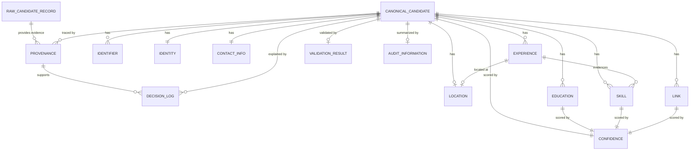

# Candidate Domain Model Specification

## 1. Overview

### Purpose

This document defines the canonical domain model for the Candidate Intelligence Transformation Engine. It is the single source of truth for future implementations that ingest candidate information from heterogeneous sources and transform it into a consistent internal representation.

The domain model is intentionally independent of external source schemas. Recruiter CSV, ATS JSON, resume documents, LinkedIn, GitHub, Workday, Greenhouse, Oracle, SAP, and future sources must all map into this canonical model before downstream processing.

### Responsibilities

The domain model is responsible for:

- Representing raw ingested candidate records without mutation.
- Representing a canonical candidate profile independent of source format.
- Preserving provenance for every business field.
- Capturing confidence and decision rationale for explainability.
- Supporting deterministic validation, merge, projection, and audit workflows.
- Providing stable internal entities that future phases can implement without schema ambiguity.

### Scope

This specification covers:

- Domain entities and relationships.
- Field definitions, datatypes, defaults, and constraints.
- Validation rules, business rules, and invariants.
- Object lifecycle from source input to projected output.
- Serialization rules for internal and external representations.
- Sample objects for review and implementation guidance.

### Goals

- Define one canonical candidate model.
- Make every field explainable through provenance, confidence, and decisions.
- Support future integrations without changing the core domain.
- Keep raw source records immutable after ingestion.
- Separate internal representation from assignment-specific projected output.

### Non-Goals

- This document does not define Python classes.
- This document does not define Pydantic models.
- This document does not implement parsing, normalization, merging, validation, projection, or AI behavior.
- This document does not prescribe database tables or storage technology.
- This document does not define UI workflows.

## 2. Domain Principles

1. **CanonicalCandidate is the single source of truth.**
   Every downstream module must operate on `CanonicalCandidate`, not external source schemas.

2. **RawCandidateRecord is immutable after ingestion.**
   Raw records preserve exactly what was received from a source. Transformations create derived objects and decisions rather than mutating raw input.

3. **Business logic never depends on external schemas.**
   Source-specific fields are mapped into canonical fields before normalization, grouping, merge, validation, projection, or audit.

4. **Every entity is serializable.**
   Domain objects must support deterministic serialization to a neutral representation such as JSON.

5. **Every entity has explicit validation rules.**
   Validation must distinguish structural, semantic, and business validation.

6. **Every business field is explainable.**
   Field values must be traceable to source records through `Provenance`, scored through `Confidence`, and explainable through `DecisionLog` when derived or selected.

7. **Internal models differ from projected output.**
   Internal models preserve more detail than assignment output schemas. Projection is an explicit boundary.

8. **No duplicate definitions.**
   Each concept has one entity and one field name. Aliases from external sources must be normalized into canonical names.

9. **Empty and unknown are different.**
   Empty means known to be blank. Unknown means no source provided a reliable value.

10. **All timestamps are timezone-aware.**
    Time fields must be represented in UTC unless source-local timezone is explicitly preserved as metadata.

## 3. Entity Catalogue

| Entity | Responsibility |
| --- | --- |
| `RawCandidateRecord` | Immutable source record captured at ingestion before parsing or mapping. |
| `CanonicalCandidate` | Internal canonical candidate profile used by all downstream modules. |
| `Identity` | Candidate name and identity attributes. |
| `Identifier` | Stable identifier such as email, phone, ATS ID, LinkedIn URL, or source record ID. |
| `ContactInfo` | Candidate communication details. |
| `Location` | Structured physical or remote location information. |
| `Experience` | Employment, project, or professional history entry. |
| `Education` | Academic or certification education entry. |
| `Skill` | Canonical skill, tool, language, platform, or competency. |
| `Link` | External profile, portfolio, repository, or document link. |
| `Confidence` | Quantified reliability of a value or entity. |
| `Provenance` | Source traceability for a value, entity, or decision. |
| `DecisionLog` | Explainable record of mapping, normalization, selection, merge, or validation decisions. |
| `Metadata` | Non-business operational metadata about model construction. |
| `AuditInformation` | High-level audit summary for pipeline processing. |
| `ValidationResult` | Structured validation outcome for an entity or field. |

## 4. Detailed Entity Specifications

### 4.1 RawCandidateRecord

#### Purpose

Preserve an immutable source record exactly as received at ingestion.

#### Responsibilities

- Store source payload and source metadata.
- Preserve original source identity.
- Provide immutable traceability into downstream provenance.

#### Fields

| Field | Datatype | Required | Default | Description |
| --- | --- | --- | --- | --- |
| `record_id` | string | yes | none | Engine-generated stable identifier for the raw record. |
| `source_type` | enum string | yes | none | Source category such as `CSV`, `ATS`, `Resume`, `LinkedIn`, or `GitHub`. |
| `source_system` | string | yes | none | Specific system or provider, for example `greenhouse`, `workday`, or `recruiter_csv`. |
| `source_record_id` | string | no | null | Identifier supplied by the external source. |
| `ingested_at` | datetime UTC | yes | current ingestion time | Timestamp when the engine accepted the record. |
| `payload_format` | enum string | yes | none | Format such as `csv_row`, `json_document`, `pdf_text`, `docx_text`, or `api_response`. |
| `payload` | object | yes | none | Original parsed container preserving source values without canonical interpretation. |
| `raw_text` | string | no | null | Extracted text for document-like sources. |
| `checksum` | string | yes | none | Deterministic checksum of source payload for deduplication and audit. |
| `metadata` | `Metadata` | yes | empty metadata | Operational metadata about ingestion. |

#### Validation Rules

- `record_id` must be globally unique within a pipeline run.
- `source_type` must be one of the supported source type values.
- `payload` must not be empty.
- `checksum` must be deterministic for identical source content.
- `ingested_at` must be timezone-aware.

#### Business Rules

- Raw records are append-only and immutable after ingestion.
- Raw records may be reprocessed, but reprocessing must create new decisions, not alter the original record.
- Multiple raw records may contribute to one canonical candidate.

#### Invariants

- A raw record always has exactly one `source_type`.
- A raw record always has exactly one `checksum`.
- A raw record must be referenced by provenance before any mapped value can claim source traceability.

#### Serialization Example

```json
{
  "record_id": "raw_20260630_0001",
  "source_type": "CSV",
  "source_system": "recruiter_csv",
  "source_record_id": "row_17",
  "ingested_at": "2026-06-30T09:30:00Z",
  "payload_format": "csv_row",
  "payload": {
    "full_name": "Anika Rao",
    "email": "anika.rao@example.com",
    "skills": "Python; SQL; Streamlit"
  },
  "raw_text": null,
  "checksum": "sha256:9d2f...",
  "metadata": {
    "created_at": "2026-06-30T09:30:00Z",
    "created_by": "candidate-transformer",
    "pipeline_version": "0.1.0",
    "tags": []
  }
}
```

#### Notes

`RawCandidateRecord` is not a candidate profile. It is the factual source artifact from which candidate information may be derived.

### 4.2 CanonicalCandidate

#### Purpose

Represent the complete internal candidate profile after mapping, normalization, grouping, and merge.

#### Responsibilities

- Aggregate identity, contact, experience, education, skills, links, and audit data.
- Provide the canonical internal contract for downstream modules.
- Preserve explainability for selected and merged values.

#### Fields

| Field | Datatype | Required | Default | Description |
| --- | --- | --- | --- | --- |
| `candidate_id` | string | yes | none | Engine-generated stable identifier for the canonical candidate. |
| `identifiers` | array of `Identifier` | yes | empty array | All known identifiers associated with the candidate. |
| `identity` | `Identity` | yes | empty identity | Candidate name and identity attributes. |
| `contact_info` | `ContactInfo` | yes | empty contact info | Candidate communication details. |
| `location` | `Location` | no | null | Best known candidate location. |
| `experiences` | array of `Experience` | yes | empty array | Professional history entries. |
| `education` | array of `Education` | yes | empty array | Education and credential entries. |
| `skills` | array of `Skill` | yes | empty array | Normalized skills associated with the candidate. |
| `links` | array of `Link` | yes | empty array | External profiles, portfolios, or source links. |
| `summary` | string | no | null | Canonical candidate summary derived from sources. |
| `confidence` | `Confidence` | yes | default confidence | Overall confidence in the canonical candidate. |
| `provenance` | array of `Provenance` | yes | empty array | Source traceability for the candidate as a whole. |
| `decision_logs` | array of `DecisionLog` | yes | empty array | Decisions used to build or modify the candidate. |
| `validation` | `ValidationResult` | no | null | Latest validation result for this candidate. |
| `metadata` | `Metadata` | yes | empty metadata | Operational metadata about construction. |
| `audit_information` | `AuditInformation` | no | null | Pipeline-level audit summary. |

#### Validation Rules

- `candidate_id` must be globally unique.
- At least one identifier must exist before projection.
- Duplicate identifiers of the same type and normalized value are not allowed.
- Skill names must be normalized before final candidate validation.
- All provenance references must point to existing raw records or derived decisions.

#### Business Rules

- Canonical candidate values should prefer higher-confidence sources unless source priority rules override.
- Merged candidates must retain provenance from all contributing raw records.
- Derived summaries must be traceable through decision logs.

#### Invariants

- One canonical candidate may reference many raw records.
- Every business field selected from source data must have provenance.
- `candidate_id` never changes once assigned.
- The candidate must never store source-specific schema names as canonical field names.

#### Serialization Example

```json
{
  "candidate_id": "cand_8f2a91",
  "identifiers": [
    {
      "identifier_type": "email",
      "value": "anika.rao@example.com",
      "normalized_value": "anika.rao@example.com",
      "is_primary": true,
      "confidence": { "score": 0.98, "method": "direct_source", "reasons": ["Provided by recruiter CSV"] },
      "provenance": []
    }
  ],
  "identity": {
    "full_name": "Anika Rao",
    "given_name": "Anika",
    "family_name": "Rao",
    "preferred_name": null,
    "confidence": { "score": 0.96, "method": "direct_source", "reasons": ["Consistent across sources"] },
    "provenance": []
  },
  "contact_info": {
    "emails": ["anika.rao@example.com"],
    "phones": [],
    "preferred_email": "anika.rao@example.com",
    "preferred_phone": null,
    "confidence": { "score": 0.98, "method": "direct_source", "reasons": ["Valid email format"] },
    "provenance": []
  },
  "location": null,
  "experiences": [],
  "education": [],
  "skills": [],
  "links": [],
  "summary": null,
  "confidence": { "score": 0.92, "method": "aggregate", "reasons": ["Strong identifier and contact evidence"] },
  "provenance": [],
  "decision_logs": [],
  "validation": null,
  "metadata": {
    "created_at": "2026-06-30T09:31:00Z",
    "created_by": "candidate-transformer",
    "pipeline_version": "0.1.0",
    "tags": []
  },
  "audit_information": null
}
```

#### Notes

`CanonicalCandidate` is intentionally richer than projected assignment output. Projection rules decide what subset and shape to emit.

### 4.3 Identity

#### Purpose

Represent candidate name and identity attributes independent of external naming conventions.

#### Responsibilities

- Store normalized name components.
- Preserve confidence and provenance for identity fields.
- Support future multiple identity representations.

#### Fields

| Field | Datatype | Required | Default | Description |
| --- | --- | --- | --- | --- |
| `full_name` | string | no | null | Best canonical full name. |
| `given_name` | string | no | null | First or given name. |
| `middle_name` | string | no | null | Middle name or initials. |
| `family_name` | string | no | null | Last or family name. |
| `preferred_name` | string | no | null | Preferred display name. |
| `headline` | string | no | null | Professional headline if available. |
| `confidence` | `Confidence` | yes | default confidence | Confidence in identity values. |
| `provenance` | array of `Provenance` | yes | empty array | Source traceability for identity values. |

#### Validation Rules

- At least one of `full_name`, `given_name`, `family_name`, or an identifier must exist for a usable candidate.
- Name fields must be trimmed.
- Name fields must not contain email addresses or phone numbers.

#### Business Rules

- `preferred_name` is used for display only and does not replace legal or canonical name fields.
- `full_name` may be derived from components when absent, but that derivation must create a `DecisionLog`.

#### Invariants

- Identity fields do not contain source-specific labels.
- Identity confidence must reflect source agreement and parsing certainty.

#### Serialization Example

```json
{
  "full_name": "Anika Rao",
  "given_name": "Anika",
  "middle_name": null,
  "family_name": "Rao",
  "preferred_name": null,
  "headline": "Senior Data Engineer",
  "confidence": { "score": 0.96, "method": "direct_source", "reasons": ["Consistent full name"] },
  "provenance": []
}
```

#### Notes

Identity does not decide candidate uniqueness alone. Candidate grouping uses identifiers and evidence across entities.

### 4.4 Identifier

#### Purpose

Represent stable identity evidence used for grouping, deduplication, and traceability.

#### Responsibilities

- Store raw and normalized identifier values.
- Mark primary identifiers.
- Support deterministic candidate grouping.

#### Fields

| Field | Datatype | Required | Default | Description |
| --- | --- | --- | --- | --- |
| `identifier_type` | enum string | yes | none | Type such as `email`, `phone`, `ats_id`, `linkedin_url`, `github_url`, `source_record_id`. |
| `value` | string | yes | none | Original identifier value after safe trimming. |
| `normalized_value` | string | yes | none | Canonical comparable value. |
| `source_system` | string | no | null | Source system that provided the identifier. |
| `is_primary` | boolean | yes | false | Whether this identifier is preferred for its type. |
| `confidence` | `Confidence` | yes | default confidence | Confidence in identifier correctness. |
| `provenance` | array of `Provenance` | yes | empty array | Source traceability for identifier value. |

#### Validation Rules

- `identifier_type` must be supported.
- `value` and `normalized_value` must be non-empty.
- Email identifiers must satisfy email syntax validation.
- URL identifiers must satisfy URL syntax validation.

#### Business Rules

- At most one primary identifier is allowed per identifier type.
- Duplicate normalized identifiers of the same type are collapsed after normalization.

#### Invariants

- Candidate projection must not emit duplicate identifiers.
- Every identifier must have confidence and provenance.

#### Serialization Example

```json
{
  "identifier_type": "email",
  "value": "Anika.Rao@Example.com",
  "normalized_value": "anika.rao@example.com",
  "source_system": "recruiter_csv",
  "is_primary": true,
  "confidence": { "score": 0.98, "method": "format_and_source", "reasons": ["Valid email format"] },
  "provenance": []
}
```

#### Notes

Identifiers are evidence, not guaranteed truth. Conflicting identifiers must be handled through grouping and decision logs.

### 4.5 ContactInfo

#### Purpose

Represent candidate communication channels.

#### Responsibilities

- Store normalized emails and phones.
- Identify preferred contact values.
- Preserve contact confidence and provenance.

#### Fields

| Field | Datatype | Required | Default | Description |
| --- | --- | --- | --- | --- |
| `emails` | array of string | yes | empty array | Normalized email addresses. |
| `phones` | array of string | yes | empty array | Normalized phone numbers in international format when possible. |
| `preferred_email` | string | no | null | Preferred email selected from `emails`. |
| `preferred_phone` | string | no | null | Preferred phone selected from `phones`. |
| `confidence` | `Confidence` | yes | default confidence | Confidence in contact values. |
| `provenance` | array of `Provenance` | yes | empty array | Source traceability for contact values. |

#### Validation Rules

- Emails must be syntactically valid.
- Phones must preserve country code when available.
- `preferred_email` must exist in `emails` when present.
- `preferred_phone` must exist in `phones` when present.

#### Business Rules

- Duplicate emails are removed after normalization.
- Duplicate phones are removed after normalization.
- Work and personal email classification is optional metadata, not a separate canonical field in Phase 2.

#### Invariants

- Contact values must never contradict identifiers of the same type.
- Preferred contact values must be selected deterministically.

#### Serialization Example

```json
{
  "emails": ["anika.rao@example.com"],
  "phones": ["+14155550120"],
  "preferred_email": "anika.rao@example.com",
  "preferred_phone": "+14155550120",
  "confidence": { "score": 0.95, "method": "format_and_source", "reasons": ["Email and phone validated structurally"] },
  "provenance": []
}
```

#### Notes

Phone validation must support international formats and incomplete local formats without discarding source evidence.

### 4.6 Location

#### Purpose

Represent candidate geographic or remote work location.

#### Responsibilities

- Store structured location components.
- Preserve original display value.
- Support future geocoding without changing canonical shape.

#### Fields

| Field | Datatype | Required | Default | Description |
| --- | --- | --- | --- | --- |
| `display_name` | string | no | null | Human-readable location string. |
| `city` | string | no | null | City or locality. |
| `region` | string | no | null | State, province, or region. |
| `country` | string | no | null | Country name or ISO-compatible country value. |
| `country_code` | string | no | null | ISO 3166-1 alpha-2 country code when known. |
| `postal_code` | string | no | null | Postal or ZIP code. |
| `timezone` | string | no | null | IANA timezone when known. |
| `remote_preference` | enum string | no | null | `remote`, `hybrid`, `onsite`, or `unknown`. |
| `confidence` | `Confidence` | yes | default confidence | Confidence in location values. |
| `provenance` | array of `Provenance` | yes | empty array | Source traceability for location values. |

#### Validation Rules

- `country_code` must be two uppercase letters when present.
- `timezone` must be a valid IANA timezone when present.
- `remote_preference` must be supported.

#### Business Rules

- `display_name` may exist without structured components.
- Structured components should not be guessed without provenance or decision logging.

#### Invariants

- Location does not imply work authorization.
- Location values must preserve uncertainty through confidence.

#### Serialization Example

```json
{
  "display_name": "Bengaluru, Karnataka, India",
  "city": "Bengaluru",
  "region": "Karnataka",
  "country": "India",
  "country_code": "IN",
  "postal_code": null,
  "timezone": "Asia/Kolkata",
  "remote_preference": "hybrid",
  "confidence": { "score": 0.88, "method": "parsed_source", "reasons": ["Parsed from resume location"] },
  "provenance": []
}
```

#### Notes

Geocoding enrichment may add structured components later, but must not overwrite source-provided values without decisions.

### 4.7 Experience

#### Purpose

Represent a professional role, project, internship, contract, or employment history item.

#### Responsibilities

- Store role, organization, dates, description, and related skills.
- Support current and historical roles.
- Preserve provenance for extracted and normalized values.

#### Fields

| Field | Datatype | Required | Default | Description |
| --- | --- | --- | --- | --- |
| `experience_id` | string | yes | none | Stable identifier for this experience entry. |
| `title` | string | no | null | Role or project title. |
| `organization` | string | no | null | Employer, client, or project organization. |
| `location` | `Location` | no | null | Location associated with the role. |
| `start_date` | date | no | null | Start date; month precision is allowed. |
| `end_date` | date | no | null | End date; null may mean current if `is_current` is true. |
| `is_current` | boolean | yes | false | Whether this is a current role. |
| `description` | string | no | null | Normalized role description. |
| `highlights` | array of string | yes | empty array | Bullet achievements or responsibilities. |
| `skills` | array of `Skill` | yes | empty array | Skills evidenced by the experience. |
| `confidence` | `Confidence` | yes | default confidence | Confidence in the experience entry. |
| `provenance` | array of `Provenance` | yes | empty array | Source traceability for role values. |

#### Validation Rules

- `experience_id` must be unique within a candidate.
- `start_date` must not be after `end_date`.
- `is_current` must be false if `end_date` is in the past and no source says current.
- `title` or `organization` should exist for a usable experience entry.

#### Business Rules

- Overlapping experiences are allowed.
- Multiple experiences at the same organization are allowed.
- Date precision must be preserved when only month or year is known.

#### Invariants

- Experience entries must not be merged solely by matching organization.
- Experience skills must also appear in candidate-level skills after normalization when projected.

#### Serialization Example

```json
{
  "experience_id": "exp_001",
  "title": "Senior Data Engineer",
  "organization": "Nimbus Analytics",
  "location": null,
  "start_date": "2022-04",
  "end_date": null,
  "is_current": true,
  "description": "Built data pipelines and internal analytics applications.",
  "highlights": ["Reduced batch processing time by 35%", "Built Streamlit monitoring tools"],
  "skills": [],
  "confidence": { "score": 0.9, "method": "resume_section", "reasons": ["Extracted from structured resume experience section"] },
  "provenance": []
}
```

#### Notes

Experience entries may originate from resumes, ATS profiles, LinkedIn, or recruiter notes. Source-specific labels must not leak into canonical fields.

### 4.8 Education

#### Purpose

Represent formal education, degrees, certificates, and training programs.

#### Responsibilities

- Store institution, credential, field of study, and dates.
- Preserve education provenance and confidence.
- Support future credential verification.

#### Fields

| Field | Datatype | Required | Default | Description |
| --- | --- | --- | --- | --- |
| `education_id` | string | yes | none | Stable identifier for this education entry. |
| `institution` | string | no | null | School, university, or issuing organization. |
| `credential` | string | no | null | Degree, diploma, certificate, or credential name. |
| `field_of_study` | string | no | null | Major, specialization, or subject. |
| `start_date` | date | no | null | Start date when known. |
| `end_date` | date | no | null | Completion or expected completion date. |
| `grade` | string | no | null | GPA, grade, honors, or classification. |
| `confidence` | `Confidence` | yes | default confidence | Confidence in education values. |
| `provenance` | array of `Provenance` | yes | empty array | Source traceability for education values. |

#### Validation Rules

- `education_id` must be unique within a candidate.
- `start_date` must not be after `end_date`.
- At least one of `institution`, `credential`, or `field_of_study` must exist for a usable entry.

#### Business Rules

- Certifications may be represented as education entries when they are credential-like.
- Skills learned from education may also appear as candidate skills if explicitly sourced.

#### Invariants

- Education entries must preserve source wording for credential ambiguity.
- Education confidence must reflect extraction certainty and source reliability.

#### Serialization Example

```json
{
  "education_id": "edu_001",
  "institution": "National Institute of Technology Karnataka",
  "credential": "B.Tech",
  "field_of_study": "Computer Science",
  "start_date": "2016",
  "end_date": "2020",
  "grade": null,
  "confidence": { "score": 0.87, "method": "resume_section", "reasons": ["Extracted from education section"] },
  "provenance": []
}
```

#### Notes

Credential normalization must be deterministic and auditable.

### 4.9 Skill

#### Purpose

Represent a normalized skill, tool, language, framework, platform, or competency.

#### Responsibilities

- Store canonical and source skill names.
- Support deduplication and categorization.
- Preserve evidence and confidence.

#### Fields

| Field | Datatype | Required | Default | Description |
| --- | --- | --- | --- | --- |
| `skill_id` | string | yes | none | Stable identifier for the normalized skill entry. |
| `name` | string | yes | none | Canonical skill name. |
| `raw_name` | string | no | null | Source-provided skill string. |
| `category` | enum string | no | null | Category such as `programming_language`, `framework`, `database`, `cloud`, `soft_skill`, or `domain`. |
| `aliases` | array of string | yes | empty array | Known aliases encountered during normalization. |
| `years_experience` | decimal | no | null | Years of experience if explicitly stated or confidently derived. |
| `last_used` | date | no | null | Last known use date. |
| `evidence_count` | integer | yes | 0 | Number of distinct source references supporting the skill. |
| `confidence` | `Confidence` | yes | default confidence | Confidence in skill normalization and relevance. |
| `provenance` | array of `Provenance` | yes | empty array | Source traceability for skill evidence. |

#### Validation Rules

- `name` must be non-empty.
- `evidence_count` must be zero or positive.
- `years_experience` must be zero or positive when present.
- Duplicate normalized skill names are not allowed within a candidate.

#### Business Rules

- Source aliases map to a canonical `name`.
- Skills may be extracted from explicit skill sections, experience descriptions, education, links, or enriched profiles.
- A skill with weak inferred evidence may remain but must have lower confidence.

#### Invariants

- Candidate-level skills are unique by canonical `name`.
- Every skill must have at least one provenance entry before final projection.

#### Serialization Example

```json
{
  "skill_id": "skill_python",
  "name": "Python",
  "raw_name": "Python",
  "category": "programming_language",
  "aliases": ["python3"],
  "years_experience": 5.0,
  "last_used": "2026",
  "evidence_count": 3,
  "confidence": { "score": 0.94, "method": "multi_source", "reasons": ["Appears in skills and experience sections"] },
  "provenance": []
}
```

#### Notes

Skill normalization must avoid collapsing distinct concepts, for example `Java` and `JavaScript`.

### 4.10 Link

#### Purpose

Represent external URLs associated with a candidate.

#### Responsibilities

- Store profile, portfolio, repository, resume, or source links.
- Normalize URLs for deduplication.
- Preserve source evidence.

#### Fields

| Field | Datatype | Required | Default | Description |
| --- | --- | --- | --- | --- |
| `link_type` | enum string | yes | none | `linkedin`, `github`, `portfolio`, `resume`, `ats_profile`, `other`. |
| `url` | string | yes | none | Original or display URL. |
| `normalized_url` | string | yes | none | Canonical comparable URL. |
| `label` | string | no | null | Human-readable link label. |
| `is_primary` | boolean | yes | false | Whether this is preferred for its link type. |
| `confidence` | `Confidence` | yes | default confidence | Confidence in link ownership and correctness. |
| `provenance` | array of `Provenance` | yes | empty array | Source traceability for link values. |

#### Validation Rules

- `url` and `normalized_url` must be valid URLs.
- `link_type` must be supported.
- At most one primary link is allowed per link type.

#### Business Rules

- Link ownership must not be assumed solely from a name match.
- Enrichment may add metadata later but must preserve the original URL.

#### Invariants

- Duplicate normalized URLs are not allowed within a candidate.
- Every link must carry confidence and provenance.

#### Serialization Example

```json
{
  "link_type": "github",
  "url": "https://github.com/anikarao",
  "normalized_url": "https://github.com/anikarao",
  "label": "GitHub",
  "is_primary": true,
  "confidence": { "score": 0.82, "method": "source_claim", "reasons": ["Listed on resume"] },
  "provenance": []
}
```

#### Notes

Links are not proof of identity without supporting evidence.

### 4.11 Confidence

#### Purpose

Represent quantified reliability for a value, entity, or candidate.

#### Responsibilities

- Store score and calculation method.
- Preserve reasons supporting the score.
- Support deterministic confidence comparisons.

#### Fields

| Field | Datatype | Required | Default | Description |
| --- | --- | --- | --- | --- |
| `score` | decimal | yes | 0.0 | Confidence score between 0.0 and 1.0. |
| `method` | string | yes | `unspecified` | Method used to assign confidence. |
| `reasons` | array of string | yes | empty array | Human-readable reasons for the score. |
| `calculated_at` | datetime UTC | no | null | Timestamp when confidence was calculated. |

#### Validation Rules

- `score` must be between 0.0 and 1.0 inclusive.
- `method` must be non-empty.
- `reasons` must not contain empty strings.

#### Business Rules

- Direct source evidence generally scores higher than inferred evidence.
- Multi-source agreement may increase confidence.
- Conflicting sources must reduce confidence or create decision logs.

#### Invariants

- Confidence is required for all business entities.
- Confidence must never be used as the only merge criterion.

#### Serialization Example

```json
{
  "score": 0.92,
  "method": "multi_source_agreement",
  "reasons": ["Email matched across ATS and resume", "Name matched exactly"],
  "calculated_at": "2026-06-30T09:32:00Z"
}
```

#### Notes

Confidence explains reliability, not candidate quality.

### 4.12 Provenance

#### Purpose

Trace a field, entity, or decision back to source evidence.

#### Responsibilities

- Identify contributing raw records.
- Locate source fields or document spans.
- Preserve source values used in transformations.

#### Fields

| Field | Datatype | Required | Default | Description |
| --- | --- | --- | --- | --- |
| `provenance_id` | string | yes | none | Stable identifier for the provenance entry. |
| `raw_record_id` | string | yes | none | Referenced `RawCandidateRecord.record_id`. |
| `source_type` | enum string | yes | none | Source type of the evidence. |
| `source_system` | string | yes | none | Source system of the evidence. |
| `source_field` | string | no | null | Field name, JSON path, column name, or section label. |
| `source_value` | scalar or object | no | null | Source value used as evidence. |
| `source_location` | string | no | null | Document page, line, span, or coordinate reference when available. |
| `extracted_at` | datetime UTC | yes | extraction time | Timestamp when evidence was extracted. |

#### Validation Rules

- `raw_record_id` must reference an existing raw record.
- `source_type` must match the referenced raw record.
- `source_field` or `source_location` should exist when source granularity is available.

#### Business Rules

- Derived values may reference multiple provenance entries.
- Provenance must preserve enough detail to audit why a value exists.

#### Invariants

- Every final projected business value must have at least one provenance path internally.
- Provenance entries are append-only.

#### Serialization Example

```json
{
  "provenance_id": "prov_001",
  "raw_record_id": "raw_20260630_0001",
  "source_type": "CSV",
  "source_system": "recruiter_csv",
  "source_field": "email",
  "source_value": "Anika.Rao@Example.com",
  "source_location": "row 17, column email",
  "extracted_at": "2026-06-30T09:30:10Z"
}
```

#### Notes

Provenance is evidence. It does not determine whether the value should be selected.

### 4.13 DecisionLog

#### Purpose

Record deterministic decisions made during mapping, normalization, grouping, merge, validation, or projection.

#### Responsibilities

- Explain why a value was selected, modified, rejected, merged, or flagged.
- Reference affected fields and supporting provenance.
- Support human audit and automated regression testing.

#### Fields

| Field | Datatype | Required | Default | Description |
| --- | --- | --- | --- | --- |
| `decision_id` | string | yes | none | Stable identifier for the decision. |
| `decision_type` | enum string | yes | none | `mapping`, `normalization`, `grouping`, `merge`, `validation`, `projection`. |
| `field_path` | string | yes | none | Canonical field path affected by the decision. |
| `input_values` | array of scalar or object | yes | empty array | Values considered by the decision. |
| `selected_value` | scalar or object | no | null | Value selected by the decision. |
| `rejected_values` | array of scalar or object | yes | empty array | Values rejected or deprioritized. |
| `reason` | string | yes | none | Human-readable rationale. |
| `rule_id` | string | no | null | Identifier for the rule or policy used. |
| `provenance_ids` | array of string | yes | empty array | Referenced provenance entries. |
| `created_at` | datetime UTC | yes | current decision time | Timestamp when decision was made. |

#### Validation Rules

- `field_path` must reference a valid canonical field.
- `decision_type` must be supported.
- `reason` must be non-empty.
- All `provenance_ids` must reference existing provenance entries.

#### Business Rules

- Any derived, normalized, or conflict-resolved value must create a decision log.
- Decisions must be deterministic for identical inputs and configuration.

#### Invariants

- Decision logs must not reference invalid fields.
- Decision logs must not contain business data without provenance references when source-derived.

#### Serialization Example

```json
{
  "decision_id": "dec_001",
  "decision_type": "normalization",
  "field_path": "contact_info.emails[0]",
  "input_values": ["Anika.Rao@Example.com"],
  "selected_value": "anika.rao@example.com",
  "rejected_values": [],
  "reason": "Email normalized to lowercase for deterministic comparison.",
  "rule_id": "normalize_email_lowercase",
  "provenance_ids": ["prov_001"],
  "created_at": "2026-06-30T09:30:15Z"
}
```

#### Notes

Decision logs explain transformations. They are not error logs.

### 4.14 Metadata

#### Purpose

Represent operational metadata that does not belong to business identity.

#### Responsibilities

- Store creation and pipeline version details.
- Support tagging and future operational attributes.
- Avoid polluting business entities with infrastructure fields.

#### Fields

| Field | Datatype | Required | Default | Description |
| --- | --- | --- | --- | --- |
| `created_at` | datetime UTC | yes | current time | Object creation timestamp. |
| `updated_at` | datetime UTC | no | null | Last update timestamp when mutable derived objects change. |
| `created_by` | string | yes | `candidate-transformer` | Component that created the object. |
| `pipeline_version` | string | yes | current pipeline version | Version of the engine that produced the object. |
| `tags` | array of string | yes | empty array | Operational tags. |

#### Validation Rules

- Timestamps must be timezone-aware.
- `created_by` must be non-empty.
- `pipeline_version` must be non-empty.

#### Business Rules

- Metadata must not store candidate business attributes.
- Tags must be operational, not a replacement for structured fields.

#### Invariants

- `created_at` must not be later than `updated_at` when both exist.
- Metadata is required on raw records and canonical candidates.

#### Serialization Example

```json
{
  "created_at": "2026-06-30T09:31:00Z",
  "updated_at": null,
  "created_by": "candidate-transformer",
  "pipeline_version": "0.1.0",
  "tags": ["phase_2_design"]
}
```

#### Notes

Metadata is not emitted to assignment output unless explicitly requested by projection configuration.

### 4.15 AuditInformation

#### Purpose

Summarize pipeline execution for a canonical candidate.

#### Responsibilities

- Store source and decision counts.
- Summarize validation and projection readiness.
- Support explainable audits without scanning every nested entity.

#### Fields

| Field | Datatype | Required | Default | Description |
| --- | --- | --- | --- | --- |
| `raw_record_count` | integer | yes | 0 | Number of raw records contributing to the candidate. |
| `provenance_count` | integer | yes | 0 | Number of provenance entries. |
| `decision_count` | integer | yes | 0 | Number of decision logs. |
| `validation_status` | enum string | yes | `not_validated` | `not_validated`, `valid`, `warning`, or `invalid`. |
| `projection_ready` | boolean | yes | false | Whether candidate satisfies projection requirements. |
| `generated_at` | datetime UTC | yes | current time | Audit summary timestamp. |

#### Validation Rules

- Counts must be zero or positive.
- `validation_status` must be supported.
- `projection_ready` must not be true when validation status is `invalid`.

#### Business Rules

- Audit information is derived from the candidate and pipeline context.
- Audit information must be regenerated after merge or validation changes.

#### Invariants

- Audit counts must match candidate contents at generation time.
- Audit information must not replace detailed provenance or decision logs.

#### Serialization Example

```json
{
  "raw_record_count": 2,
  "provenance_count": 14,
  "decision_count": 6,
  "validation_status": "valid",
  "projection_ready": true,
  "generated_at": "2026-06-30T09:35:00Z"
}
```

#### Notes

Audit information is a summary for review and observability.

### 4.16 ValidationResult

#### Purpose

Represent validation outcomes for an entity or field.

#### Responsibilities

- Store errors, warnings, and informational messages.
- Separate structural, semantic, and business validation.
- Support projection gating.

#### Fields

| Field | Datatype | Required | Default | Description |
| --- | --- | --- | --- | --- |
| `is_valid` | boolean | yes | false | Whether validation passed without blocking errors. |
| `errors` | array of string | yes | empty array | Blocking validation failures. |
| `warnings` | array of string | yes | empty array | Non-blocking concerns. |
| `info` | array of string | yes | empty array | Informational validation notes. |
| `validated_at` | datetime UTC | yes | current time | Validation timestamp. |
| `validator_version` | string | yes | current validator version | Version of validation rules used. |

#### Validation Rules

- `is_valid` must be false when `errors` is non-empty.
- Messages must be non-empty.
- `validated_at` must be timezone-aware.

#### Business Rules

- Structural validation runs before semantic validation.
- Semantic validation runs before business validation.
- Projection must fail when candidate validation has blocking errors.

#### Invariants

- Validation results must be reproducible for identical object and rule version.
- Validation messages must reference canonical field paths when field-specific.

#### Serialization Example

```json
{
  "is_valid": true,
  "errors": [],
  "warnings": ["location.country_code is unknown"],
  "info": ["candidate has one verified email identifier"],
  "validated_at": "2026-06-30T09:34:00Z",
  "validator_version": "0.1.0"
}
```

#### Notes

Validation results describe model quality, not candidate suitability.

## 5. Relationships

### Relationship Summary

```text
RawCandidateRecord
        |
        v
Provenance -----> DecisionLog
        |              |
        v              v
CanonicalCandidate ---> ValidationResult
        |
        +-- Identity
        +-- Identifier[]
        +-- ContactInfo
        +-- Location
        +-- Experience[] ----> Skill[]
        +-- Education[]
        +-- Skill[]
        +-- Link[]
        +-- Confidence
        +-- Metadata
        +-- AuditInformation
```

### Mermaid Entity Diagram



### Relationship Rules

- `RawCandidateRecord` never depends on `CanonicalCandidate`.
- `Provenance` references `RawCandidateRecord`.
- `DecisionLog` references canonical field paths and provenance IDs.
- `CanonicalCandidate` owns its nested domain entities for projection purposes.
- `Experience.skills` may reference skill concepts that also appear in `CanonicalCandidate.skills`.
- `AuditInformation` is derived from the candidate and must not be treated as source evidence.

## 6. Object Lifecycle

```text
Uploaded File or API Payload
        |
        v
RawCandidateRecord
        |
        v
Canonical Mapping
        |
        v
Partial CanonicalCandidate
        |
        v
Normalization
        |
        v
Normalized CanonicalCandidate
        |
        v
Candidate Grouping
        |
        v
Candidate Merge
        |
        v
CanonicalCandidate
        |
        v
ValidationResult + AuditInformation
        |
        v
Projection Layer
        |
        v
Assignment Output JSON
```

### Lifecycle Stages

| Stage | Object Exists | Description |
| --- | --- | --- |
| Ingestion | `RawCandidateRecord` | Source data is captured immutably with checksum and source metadata. |
| Mapping | Partial `CanonicalCandidate` | Source fields are mapped to canonical fields with provenance. |
| Normalization | `CanonicalCandidate` | Names, emails, phones, dates, skills, links, and locations are normalized. |
| Grouping | Candidate groups | Multiple partial candidates may be grouped using identifiers and evidence. |
| Merge | Merged `CanonicalCandidate` | Candidate data is selected, merged, and explained through decisions. |
| Validation | `ValidationResult` | Structural, semantic, and business rules are evaluated. |
| Audit | `AuditInformation` | Candidate-level audit summary is generated. |
| Projection | Output JSON | Assignment-specific schema is produced from canonical fields. |

## 7. Validation Specification

### Validation Categories

| Category | Purpose | Examples |
| --- | --- | --- |
| Structural | Verify datatype, shape, required fields, and constraints. | Email is string, confidence score is decimal. |
| Semantic | Verify meaning and consistency. | Start date is before end date. |
| Business | Verify project-specific rules. | Candidate has at least one identifier before projection. |

### Field Validation Rules

| Field Area | Structural Validation | Semantic Validation | Business Validation |
| --- | --- | --- | --- |
| Email | Must be valid email syntax. | Domain must be syntactically valid. | Duplicate normalized emails are not allowed. |
| Phone | Must be string and parseable where possible. | Country code preserved when known. | Duplicate normalized phones are not allowed. |
| Dates | Must be date or partial date. | Start must not be after end. | Current role should not have past end date unless explained. |
| Skills | Must have non-empty canonical name. | Alias must map deterministically. | Duplicate normalized skills removed after normalization. |
| Experience | Must have valid object shape. | Date range and current flag must agree. | Usable entry needs title or organization. |
| Education | Must have valid object shape. | Date range must be chronological. | Usable entry needs institution, credential, or field. |
| Location | Must have supported component types. | Country code and timezone must be valid when present. | Location must not imply authorization or availability. |
| Links | Must be valid URL. | Link type should match URL host when known. | Duplicate normalized URLs removed. |
| Confidence | Score must be 0.0 to 1.0. | Method must explain score source. | Confidence cannot be sole merge criterion. |
| Provenance | Must reference raw record ID. | Source type must match raw record. | Final projected fields must be traceable internally. |
| DecisionLog | Must reference valid canonical field path. | Selected and rejected values must match decision context. | Derived or conflict-resolved values require decisions. |

## 8. Business Invariants

1. Every projected candidate must have at least one identifier.
2. Every confidence score must be between 0.0 and 1.0 inclusive.
3. Duplicate normalized emails are not allowed.
4. Duplicate normalized phones are not allowed.
5. Duplicate normalized skills are removed after normalization.
6. Duplicate normalized URLs are not allowed.
7. Decision logs must reference valid canonical field paths.
8. Every provenance entry must reference a valid raw source record.
9. Every final business value must be explainable through provenance or decision logs.
10. Raw records are immutable after ingestion.
11. Candidate IDs do not change after creation.
12. Source-specific schemas must not leak into canonical field names.
13. Validation errors prevent projection unless explicitly overridden by a documented rule.
14. Current experience entries must not have contradictory end dates without a decision log.
15. The same normalized identifier cannot belong to multiple final candidates without a conflict decision.
16. Internal model serialization must be deterministic for identical objects.
17. Projection must not mutate the internal canonical candidate.
18. Audit counts must match candidate contents at audit generation time.
19. Enrichment data must not overwrite sourced data without provenance and a decision log.
20. Confidence represents data reliability, not candidate quality.

## 9. Serialization Rules

### Internal Serialization

Internal model serialization must preserve:

- All canonical fields.
- Nested entities.
- Confidence objects.
- Provenance arrays.
- Decision logs.
- Validation and audit information.
- Metadata.

Internal serialization is designed for traceability, debugging, reprocessing, and audit.

### Projection Layer

Projection converts `CanonicalCandidate` into assignment-specific output JSON. Projection must:

- Read from canonical fields only.
- Never read from raw source schemas.
- Never mutate internal objects.
- Omit internal-only audit fields unless requested.
- Preserve deterministic ordering for arrays where possible.

### Assignment Output Mapping

| Output Field | Internal Source | Rule |
| --- | --- | --- |
| `candidate_id` | `CanonicalCandidate.candidate_id` | Emit unchanged. |
| `name` | `CanonicalCandidate.identity.full_name` | Use full name; derive from components only if decision exists. |
| `email` | `CanonicalCandidate.contact_info.preferred_email` | Emit preferred email; null if absent. |
| `phone` | `CanonicalCandidate.contact_info.preferred_phone` | Emit preferred phone; null if absent. |
| `location` | `CanonicalCandidate.location.display_name` | Emit display value when present. |
| `skills` | `CanonicalCandidate.skills[].name` | Emit unique canonical skill names sorted by configured projection rule. |
| `experience` | `CanonicalCandidate.experiences[]` | Emit projected role title, organization, dates, and highlights. |
| `education` | `CanonicalCandidate.education[]` | Emit projected institution, credential, field, and dates. |
| `links` | `CanonicalCandidate.links[]` | Emit normalized URLs and link types. |
| `confidence` | `CanonicalCandidate.confidence.score` | Emit only score unless explainability output is requested. |
| `provenance` | `CanonicalCandidate.provenance[]` | Emit only when audit/explainability projection is enabled. |
| `decisions` | `CanonicalCandidate.decision_logs[]` | Emit only when audit/explainability projection is enabled. |

### Serialization Invariants

- Internal serialization contains more information than projected output.
- Projection output must be reproducible for identical candidate and projection configuration.
- Fields with unknown values serialize as null or are omitted according to projection configuration.
- Empty arrays serialize as empty arrays unless projection configuration omits empty collections.

## 10. Sample Objects

### RawCandidateRecord

```json
{
  "record_id": "raw_001",
  "source_type": "Resume",
  "source_system": "resume_pdf",
  "source_record_id": "resume_upload_123",
  "ingested_at": "2026-06-30T09:30:00Z",
  "payload_format": "pdf_text",
  "payload": {
    "file_name": "anika_rao_resume.pdf",
    "pages": 2
  },
  "raw_text": "Anika Rao\\nSenior Data Engineer\\nPython, SQL, AWS...",
  "checksum": "sha256:abc123",
  "metadata": {
    "created_at": "2026-06-30T09:30:00Z",
    "created_by": "candidate-transformer",
    "pipeline_version": "0.1.0",
    "tags": []
  }
}
```

### CanonicalCandidate

```json
{
  "candidate_id": "cand_001",
  "identifiers": [
    {
      "identifier_type": "email",
      "value": "anika.rao@example.com",
      "normalized_value": "anika.rao@example.com",
      "source_system": "resume_pdf",
      "is_primary": true,
      "confidence": { "score": 0.98, "method": "direct_source", "reasons": ["Valid email"] },
      "provenance": []
    }
  ],
  "identity": {
    "full_name": "Anika Rao",
    "given_name": "Anika",
    "middle_name": null,
    "family_name": "Rao",
    "preferred_name": null,
    "headline": "Senior Data Engineer",
    "confidence": { "score": 0.96, "method": "resume_header", "reasons": ["Name extracted from header"] },
    "provenance": []
  },
  "contact_info": {
    "emails": ["anika.rao@example.com"],
    "phones": ["+14155550120"],
    "preferred_email": "anika.rao@example.com",
    "preferred_phone": "+14155550120",
    "confidence": { "score": 0.95, "method": "format_validation", "reasons": ["Email and phone parsed successfully"] },
    "provenance": []
  },
  "location": {
    "display_name": "San Francisco, CA, United States",
    "city": "San Francisco",
    "region": "CA",
    "country": "United States",
    "country_code": "US",
    "postal_code": null,
    "timezone": "America/Los_Angeles",
    "remote_preference": "hybrid",
    "confidence": { "score": 0.84, "method": "parsed_source", "reasons": ["Location appears in resume header"] },
    "provenance": []
  },
  "experiences": [],
  "education": [],
  "skills": [],
  "links": [],
  "summary": "Senior Data Engineer with experience in Python, SQL, AWS, and analytics tooling.",
  "confidence": { "score": 0.91, "method": "aggregate", "reasons": ["Strong identity, contact, and skill evidence"] },
  "provenance": [],
  "decision_logs": [],
  "validation": null,
  "metadata": {
    "created_at": "2026-06-30T09:35:00Z",
    "created_by": "candidate-transformer",
    "pipeline_version": "0.1.0",
    "tags": []
  },
  "audit_information": null
}
```

### Experience

```json
{
  "experience_id": "exp_001",
  "title": "Senior Data Engineer",
  "organization": "Nimbus Analytics",
  "location": null,
  "start_date": "2022-04",
  "end_date": null,
  "is_current": true,
  "description": "Built data pipelines and analytics applications.",
  "highlights": ["Reduced batch latency by 35%", "Built internal Streamlit observability tools"],
  "skills": [],
  "confidence": { "score": 0.9, "method": "resume_section", "reasons": ["Structured experience entry"] },
  "provenance": []
}
```

### Education

```json
{
  "education_id": "edu_001",
  "institution": "National Institute of Technology Karnataka",
  "credential": "B.Tech",
  "field_of_study": "Computer Science",
  "start_date": "2016",
  "end_date": "2020",
  "grade": null,
  "confidence": { "score": 0.87, "method": "resume_section", "reasons": ["Structured education entry"] },
  "provenance": []
}
```

### Skill

```json
{
  "skill_id": "skill_python",
  "name": "Python",
  "raw_name": "Python",
  "category": "programming_language",
  "aliases": ["python3"],
  "years_experience": 5.0,
  "last_used": "2026",
  "evidence_count": 4,
  "confidence": { "score": 0.94, "method": "multi_source", "reasons": ["Mentioned in skills and experience"] },
  "provenance": []
}
```

### Confidence

```json
{
  "score": 0.94,
  "method": "multi_source",
  "reasons": ["Value appears in resume and ATS profile"],
  "calculated_at": "2026-06-30T09:36:00Z"
}
```

### Provenance

```json
{
  "provenance_id": "prov_001",
  "raw_record_id": "raw_001",
  "source_type": "Resume",
  "source_system": "resume_pdf",
  "source_field": "skills_section",
  "source_value": "Python, SQL, AWS",
  "source_location": "page 1, skills section",
  "extracted_at": "2026-06-30T09:31:00Z"
}
```

### DecisionLog

```json
{
  "decision_id": "dec_001",
  "decision_type": "normalization",
  "field_path": "skills[0].name",
  "input_values": ["python3", "Python"],
  "selected_value": "Python",
  "rejected_values": ["python3"],
  "reason": "Alias python3 normalized to canonical skill Python.",
  "rule_id": "skill_alias_python",
  "provenance_ids": ["prov_001"],
  "created_at": "2026-06-30T09:32:00Z"
}
```

## 11. Design Decisions

### Why CanonicalCandidate Exists

External systems model candidates differently. A single canonical representation prevents downstream modules from depending on source-specific schemas and makes validation, merge, projection, and audit consistent.

### Why Provenance Is Embedded

Candidate data often comes from conflicting or incomplete sources. Embedded provenance ensures every selected value can be traced back to source evidence during debugging, audit, and explainability review.

### Why Confidence Is Separate

Confidence describes reliability and extraction certainty. It is separate from field values so values can remain simple while reliability can evolve through better scoring methods.

### Why DecisionLog Exists

Mapping, normalization, grouping, merge, and projection decisions must be explainable. Decision logs make deterministic transformations reviewable and testable.

### Why RawCandidateRecord Is Immutable

Immutable raw records preserve source truth. They make reprocessing deterministic and prevent accidental loss of evidence.

### Why Internal Models Differ From Projected Output

Internal models must preserve traceability, decisions, validation, and audit details. Assignment output is a consumer-specific projection and should not constrain the canonical domain.

## 12. Future Evolution

### Multiple Resumes

The model already supports multiple `RawCandidateRecord` entries and many provenance references. Multiple resumes can contribute to one candidate without changing `CanonicalCandidate`.

### Multiple Identities

Additional identity representations can be supported by extending identity evidence and identifiers while preserving the existing `Identity` contract.

### International Phone Numbers

Phone values are strings with normalization rules rather than region-specific numeric fields. This supports international formats and partial local numbers.

### Multiple Languages

Text fields may be extended with language metadata in future without changing canonical entity ownership.

### Additional ATS Vendors

New ATS vendors map into existing raw records, identifiers, experiences, education, skills, links, provenance, and decisions. Core domain entities do not change.

### LinkedIn Enrichment

LinkedIn profile data maps to identifiers, links, identity, experience, education, skills, provenance, confidence, and decisions.

### GitHub Enrichment

GitHub data maps to links, identifiers, skills, project-like experience, provenance, confidence, and decisions.

### Workday, Greenhouse, Oracle, and SAP

Vendor-specific schemas remain adapter concerns. Once ingested, their data must become raw records and canonical entities through the same mapping and provenance model.

### Compatibility Rules

- Additive fields may be introduced when they do not alter existing meanings.
- Existing field names and semantics should remain stable.
- Breaking changes require migration documentation and versioned serialization.
- Projection changes must not require canonical model changes unless the new output requires genuinely new domain meaning.

